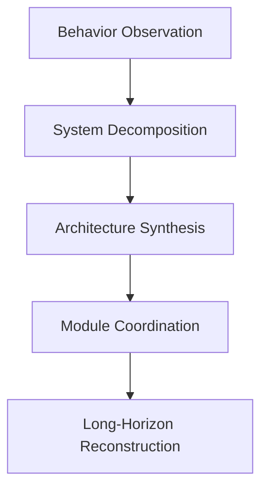
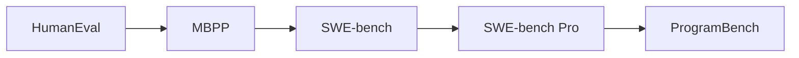
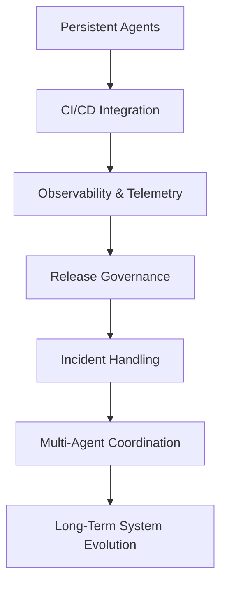

_Why "writing code" is no longer the right question_

For the past few years, the AI coding discussion has largely revolved around a simple narrative:

> Models are getting better at writing code.

Benchmarks such as:

- HumanEval
- MBPP
- SWE-bench

all reinforced this framing.

But after reading the recently released **ProgramBench** paper, I think the industry may be approaching a much more important transition.

Because ProgramBench is not primarily asking:

```text
Can AI write code?
```

Instead, it asks:

```text
Can AI reconstruct and architect software systems?
```

That distinction is enormous.

## From Code Generation to System Reconstruction

Unlike SWE-bench, which focuses on patching existing repositories, ProgramBench removes the entire source-code foundation.

The benchmark gives the model:

- executable binaries
- CLI behavior
- README and documentation

But does **not** provide:

- source code
- internet access
- decompilers

The agent must reconstruct the software system entirely from scratch.

That includes:

- architecture
- modules
- abstractions
- interfaces
- runtime behavior
- build systems
- edge-case handling

And importantly:

> evaluation is based on behavioral equivalence rather than implementation equivalence.

Meaning: the reconstructed system does not need to match the original internals as long as observable behavior matches.

That makes this benchmark fundamentally different from most coding evaluations we have today.

## Why ProgramBench Feels Different

Most modern coding benchmarks still fundamentally measure:


ProgramBench instead measures something much closer to:



This moves the discussion from:

- coding assistance

toward:

- systems engineering.

And I think that distinction matters more than most current benchmark discourse acknowledges.

## The Most Interesting Result Is How Models Fail

The headline result from the paper is that frontier models perform surprisingly poorly.

But I think the more important insight is *how* they fail.

The paper repeatedly observes that models tend toward:

- monolithic implementations
- oversized single-file designs
- weak abstractions
- poor modular decomposition
- limited architectural layering

This is one of the most revealing observations I have seen in recent AI coding research.

Because it suggests something deeper:

> Current frontier models are significantly better at modifying existing architecture than inventing robust architecture.

That is a very important distinction.

## The Repository Parasite Observation

One way I currently interpret modern coding agents is this:

They become extremely capable when an architecture already exists.

Given:

- repository structure
- conventions
- CI
- tests
- ownership patterns
- module boundaries

AI systems are remarkably effective at:

- patching
- extending
- refactoring
- optimizing

But once those structures disappear, capability drops dramatically.

That suggests current frontier AI behaves more like:

```text
an extremely capable maintenance engineer
```

than:

```text
a true systems architect
```

And honestly, this aligns very closely with what many engineers already intuitively observe in practice.

## Why Monolithic Generation Happens

I do not think this behavior is accidental.

LLMs fundamentally operate through token-sequence continuation.

That biases them toward:

- linear expansion
- local coherence
- nearby optimization

But software architecture requires almost the opposite.

Good architecture depends on:

- future extensibility
- delayed planning
- separation of concerns
- abstraction boundaries
- interface discipline
- non-local reasoning

These are inherently difficult for autoregressive generation systems.

Which explains why many AI-generated systems often feel:

```text
technically functional, but architecturally unnatural
```

The code may run.

The tests may pass.

But the system structure often lacks the kind of intentional decomposition human engineers naturally apply.

## Benchmark Evolution

ProgramBench also reflects a broader shift in how the industry evaluates AI engineering capability.

The benchmark evolution roughly looks like this:



Each stage progressively moves upward in abstraction:

| Benchmark     | Primary Capability                  |
| ------------- | ----------------------------------- |
| HumanEval     | Function generation                 |
| MBPP          | Small program synthesis             |
| SWE-bench     | Repository issue fixing             |
| SWE-bench Pro | Long-horizon repository engineering |
| ProgramBench  | Architecture synthesis              |

And this progression mirrors something important:

The hardest engineering problems are usually not:

- syntax problems
- algorithm problems
- local implementation problems

They are:

- system design problems
- coordination problems
- lifecycle problems
- complexity management problems

## Software Engineering Is Not Coding

I think this is ultimately the paper's most important philosophical implication.

Software engineering has never primarily been about code production.

It has always been about managing:

- complexity
- constraints
- maintainability
- evolution over time

A software system exists inside:

- organizations
- release processes
- deployment pipelines
- observability systems
- operational economics
- ownership structures

Traditional coding benchmarks capture very little of this.

ProgramBench begins moving toward that direction by introducing:

- ambiguity
- reconstruction
- long-horizon reasoning
- architecture formation

But even this benchmark still only captures part of real-world engineering.

## What ProgramBench Still Does Not Measure

Despite being one of the strongest benchmarks we have seen so far, several important dimensions are still missing.

### 1. Organizational Constraints

Real engineering includes:

- product negotiation
- release pressure
- rollback planning
- governance
- security reviews
- operational risk

Benchmarks still largely ignore these dimensions.

### 2. Long-Term Maintainability

Passing tests today does not mean the system remains maintainable six months later.

Real architecture quality emerges through:

- extensibility
- operational simplicity
- future iteration cost
- failure isolation

This is still very difficult to benchmark.

### 3. Human Coordination

Large-scale software engineering is fundamentally collaborative.

Many architecture decisions exist not because they are theoretically optimal, but because they:

- reduce coordination overhead
- improve team scalability
- clarify ownership

Current benchmarks still evaluate isolated agents rather than socio-technical systems.

## The Future Direction of AI Engineering Evaluation

I suspect ProgramBench represents the beginning of a larger transition.

Future benchmarks may evolve toward evaluating:



At that point:

> the benchmark itself increasingly becomes a software platform problem rather than merely a model problem.

And I think that shift is already beginning.

## Final Reflection

ProgramBench reveals something subtle but important:

> AI systems are approaching competence in modifying software,
> but remain far from mastering software engineering systems.

That gap matters enormously.

Because the highest-leverage engineering work has never primarily been:

- writing syntax
- generating boilerplate
- filling implementations

It has been:

- shaping systems
- controlling complexity
- enabling future evolution
- coordinating humans and machines over time

And ProgramBench may ultimately be remembered as one of the first benchmarks that clearly exposed this boundary.

## References

1. ProgramBench: *Can Language Models Rebuild Programs From Scratch?*  
   [https://arxiv.org/abs/2605.03546](https://arxiv.org/abs/2605.03546)

2. ProgramBench PDF  
   [https://arxiv.org/pdf/2605.03546](https://arxiv.org/pdf/2605.03546)

3. SWE-bench  
   [https://www.swebench.com/](https://www.swebench.com/)

4. SWE-bench Pro  
   [https://arxiv.org/abs/2509.16941](https://arxiv.org/abs/2509.16941)
