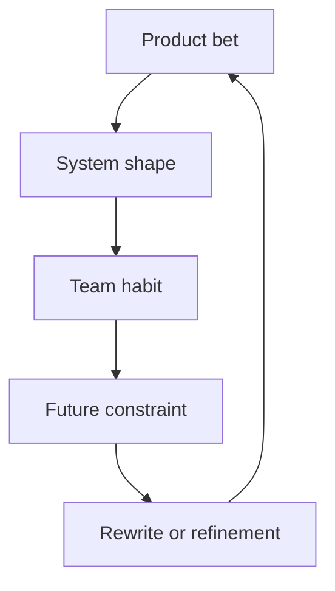

A long-running product teaches through accumulation: every architecture choice, team change, and market bet leaves a trace.

## The product remembers

The strange thing about a long-running product is that it remembers decisions even after the team forgets them. A route boundary, a status name, a chart abstraction, a retry behavior, or a package convention can survive several rounds of staffing and planning changes. The code keeps carrying the old assumptions.

That is not automatically bad. Some old assumptions are product wisdom. Some are shortcuts that became architecture. The hard part is learning which is which before rewriting everything.

## Names become load-bearing

The first lesson is that naming matters more than it seems. If the product cannot name a device state, event type, configuration scope, or ownership boundary, the code invents several names for the same thing. Those names leak into APIs, dashboards, tests, incident language, and onboarding conversations.

This is where frontend and platform work quietly meet. A label in the interface may become the term support uses. A status enum may become the API contract. A chart grouping may become how managers understand the system. Naming is not polish after architecture. It is part of architecture.

## Platform is not a place

The second lesson is that platform work is not only infrastructure. A frontend component library, a status model, a package convention, a deployment check, or a debugging playbook can become platform work if other teams build on it.

Around 2019, this often meant living with multiple generations of frontend architecture at once: older Knockout or AngularJS-era patterns, Angular or React components, Rails or Node.js APIs, npm packages, CI scripts, and dashboards built from public libraries like Chart.js or D3. The technology list is less important than the effect: once another team depends on a surface, that surface has platform responsibilities.

## Change without drama

The third lesson is that rewrites are not the only form of technical change. A product can evolve through compatibility layers, extracted utilities, better route boundaries, clearer state models, stricter validation, and more observable release paths. Those changes are less dramatic than a rewrite, but they often preserve delivery while reducing risk.

Long-running products punish designs that only optimize for the next release. They also punish teams that treat every old decision as a mistake. The better posture is to ask what the product has learned and which parts of that learning deserve a cleaner interface.

Frameworks change. The harder questions remain: what state does the product expose, which contracts stay stable, where should shared code live, and how does the team know the system is still telling the truth?
