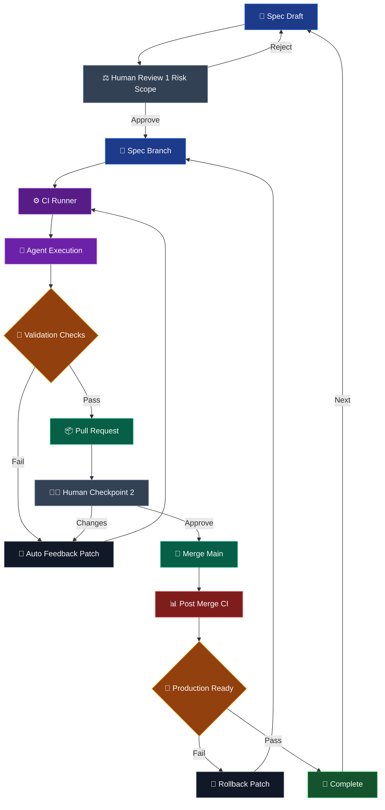

This is a spec-first delivery loop for using agents without giving up engineering judgment.

The useful part is not that an agent can write code quickly. The useful part is that the work moves through explicit checkpoints where risk, validation, and ownership stay visible.

## The operating loop

## Why the first review matters

The first human checkpoint is not a code review. It is a risk-scope review.

Before the agent starts, the spec should make the blast radius legible: what can change, what must not change, and which checks prove the work is acceptable. Rejection at this stage is cheap because no implementation has been produced yet.

## Where agents fit

Agent execution sits behind CI instead of replacing it.

The agent can patch, rerun, and respond to validation feedback, but the loop is bounded by tests, type checks, build output, and reviewable diffs. That keeps speed tied to evidence rather than confidence.

## Why there is a second checkpoint

The pull request checkpoint is where a human judges whether the result is maintainable, not only whether it passes.

If the change needs adjustment, it goes back through the feedback patch loop. If it is approved, it merges into `main` and faces post-merge validation as a separate production-readiness gate.

## Completion is temporary

The loop ends by returning to the next spec draft.

That matters because agentic engineering is not a one-shot generation event. It is a way to keep delivery moving while preserving the review, rollback, and production checks that make software dependable.
