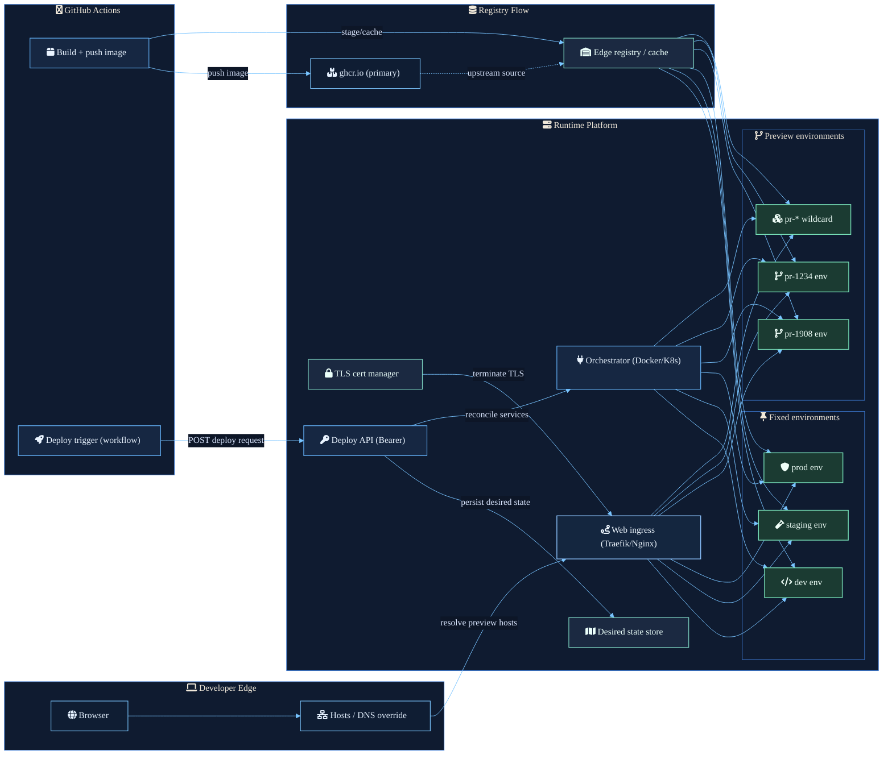

Preview environments become easier to operate when the workflow is split into clear responsibilities.

The browser does not need to know whether a target is a long-lived dev environment or a short-lived pull-request environment. GitHub Actions does not need to know how ingress rules are applied. The runtime should not infer intent from whatever containers happen to be running. Each part needs a narrow job.

## Request path

The developer edge starts with local resolution. A browser request goes through a hosts file or DNS override, then lands on the platform ingress. That makes preview hostnames explicit without coupling local machines to container placement.

## Artifact path

GitHub Actions builds and pushes the image to `ghcr.io` as the primary source. The edge registry or cache stages the image closer to the runtime platform, so fixed and dynamic environments pull from the same local artifact path.

## Control path

The deploy workflow calls a bearer-protected deploy API. That API records desired state before asking the orchestrator to reconcile services. The important boundary is that deployment intent is stored separately from runtime side effects.

## Runtime path

The orchestrator reconciles both fixed environment candidates, such as `dev`, `staging`, and `prod`, and dynamic preview environments, such as `pr-1908` or `pr-1234`. TLS terminates at the ingress layer, and the gateway routes traffic to whichever environment currently satisfies the requested hostname.

The result is a preview system where URLs, images, desired state, and service reconciliation are separate enough to debug independently, but still connected by a single deployment flow.
