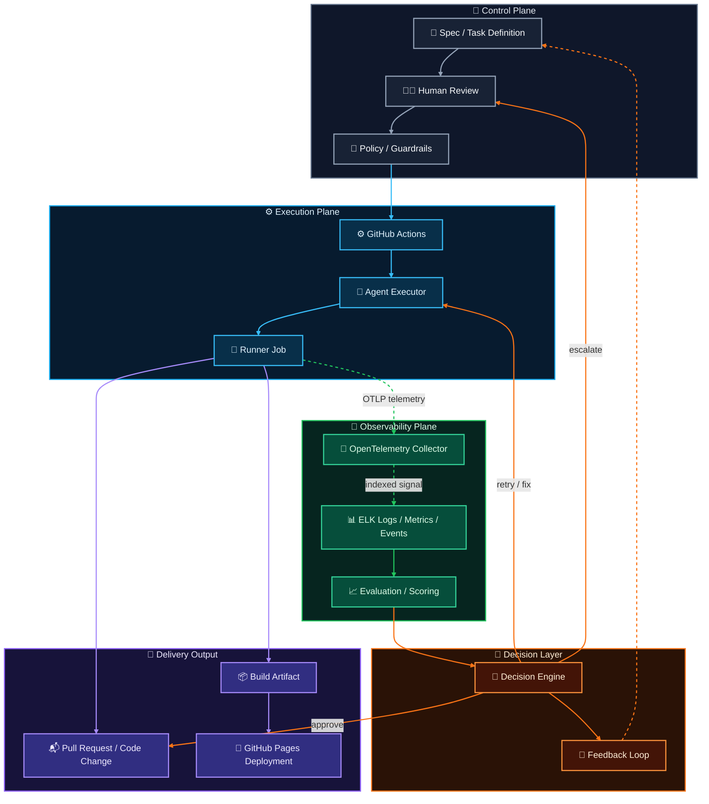

This model is not just `CI -> deploy`, and it is not just `agent -> pull request`.

It separates governance into planes. The control plane defines intent and guardrails. The execution plane produces code and artifacts. The observability plane records what happened. The decision layer turns telemetry and review signals into approval, retry, escalation, or feedback.

## Execution channel

The execution channel remains deterministic:

`Spec -> Human Review -> Policy -> GitHub Actions -> Agent Executor -> Runner Job -> Build Artifact -> GitHub Pages Deployment`

That path is responsible for state change. It decides whether a reviewed task can run, whether the runner produced a code change or artifact, and whether the static site artifact can reach GitHub Pages.

## Observability channel

The observability channel is side-band:

`Runner Job -> OpenTelemetry Collector -> ELK -> Evaluation / Scoring`

The job emits logs, metrics, traces, and events as OTLP telemetry. The collector normalizes and forwards that signal into ELK for indexing, search, dashboards, and investigation. Evaluation then turns that record into run scores, anomaly signals, and pipeline ranking inputs.

## Decision loop

The decision layer consumes evaluation output without making observability a deployment dependency.

It can approve a pull request, retry the agent with a fix, escalate back to a human reviewer, or feed lessons back into the next task definition. That makes the loop useful for agentic work: judgment remains explicit, retries remain bounded, and the system accumulates evidence about which jobs and pipelines are trustworthy.

## Governance rule

Deployment should not depend on logging success.

If telemetry ingestion is delayed or ELK is unavailable, the build path should still be able to complete or fail based on its own checks. Observability is there to explain what happened, compare runs, detect anomalies, and score or rank pipelines after the fact.

That separation keeps GitHub Actions responsible for delivery while OpenTelemetry and ELK become the diagnostic record. The result is a CI system where execution remains deterministic and diagnosis remains rich enough to support job-level traceability, anomaly detection, evaluation, and pipeline governance.
