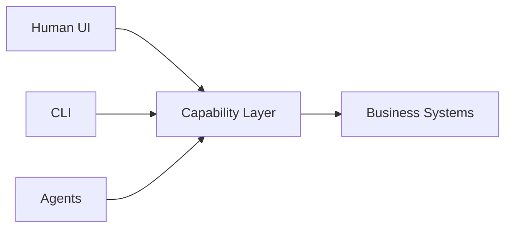

Recently I came across [Microsoft Research's WebWright article](https://www.microsoft.com/en-us/research/articles/webwright-a-terminal-is-all-you-need-for-web-agents/), and I think it represents something much bigger than just another browser automation demo.

It raises a more fundamental question:

> Do browser agents really need browsers?

## The Problem With Most Browser Agents Today

Most web agents today follow a pipeline like this:

```text
LLM
 ↓
Playwright / Puppeteer
 ↓
Browser UI
 ↓
DOM / Screenshots / OCR
```

This approach creates several recurring problems:

* expensive screenshot tokens
* noisy DOM structures
* unstable navigation
* flaky automation
* difficult state management
* slow execution
* exploding context windows

In many cases, agents do not actually need to "see the page."

They only need:

> structured actionable state

## WebWright's Core Idea

WebWright abstracts browser interaction into something closer to:

```text
Terminal Interface
```

instead of GUI-driven interaction.

Meaning:

* no screenshots
* no cursor reasoning
* no visual interpretation

Instead:

```text
Agent ↔ Structured Web Environment
```

It feels less like:

```text
Browser Automation
```

and more like:

```text
Web as an Execution Runtime
```

## What It Is Really Solving

### 1. Reducing Token Cost

Visual reasoning is expensive.

Especially in enterprise systems:

* admin dashboards
* CMS
* ERP
* CRM
* internal tools

Most workflows are repetitive and state-oriented.

Agents usually do not need to understand pixels.

They only need to know:

* available actions
* current state
* workflow transitions

### 2. Reducing Ambiguity

Modern web UIs are optimized for humans.

Not for agents.

Terminal-style interaction shifts the model toward:

* deterministic state
* semantic actions
* structured workflows

This is far more agent-friendly.

### 3. Improving Determinism

GUI automation is notoriously fragile.

Problems include:

* animation timing
* overlays
* lazy rendering
* z-index conflicts
* responsive layouts

WebWright effectively introduces:

```text
Semantic Interaction Layer
```

instead of pixel-based interaction.

## The Bigger Shift

I think the most important part is not:

> "terminal controls browser"

The real shift is:

> The Web is being re-abstracted.

Historically:

```text
Human-first Web
```

Now increasingly:

```text
Agent-first Web
```

And that changes everything.

## Possible Future Architecture



The UI becomes just one interface among many.

Agents may directly operate:

* workflows
* forms
* state machines
* capabilities
* automation pipelines

## Impact on Frontend Architecture

This has major implications for frontend engineering.

Today many systems only expose:

```text
UI
```

But the future likely requires:

```text
UI Layer
Capability Layer
Agent Layer
Automation Layer
```

Eventually:

> UI becomes only one renderer of capabilities.

## Final Thoughts

I do not think WebWright is necessarily the final answer.

But it clearly signals an important direction:

> Browsers are no longer only for humans.

They are becoming:

```text
Agent Runtime
```

And that may fundamentally reshape:

* frontend engineering
* automation
* enterprise workflows
* DevOps
* software interaction itself

The next few years will be very interesting.
