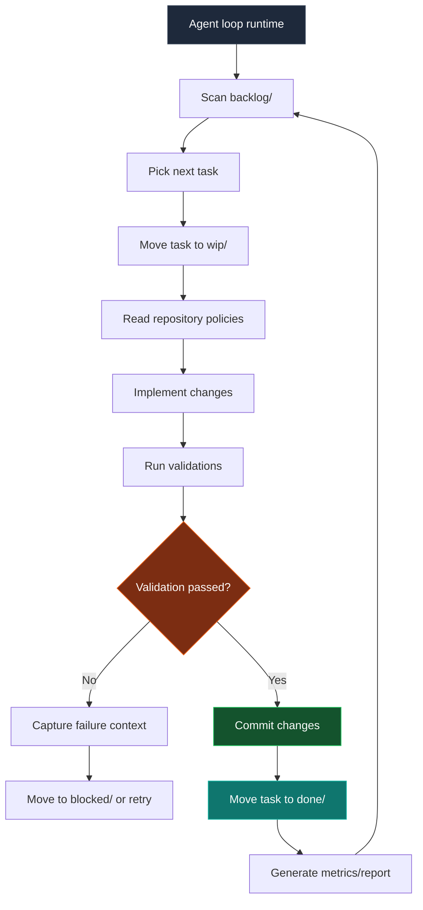
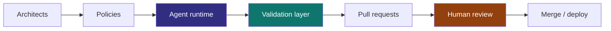
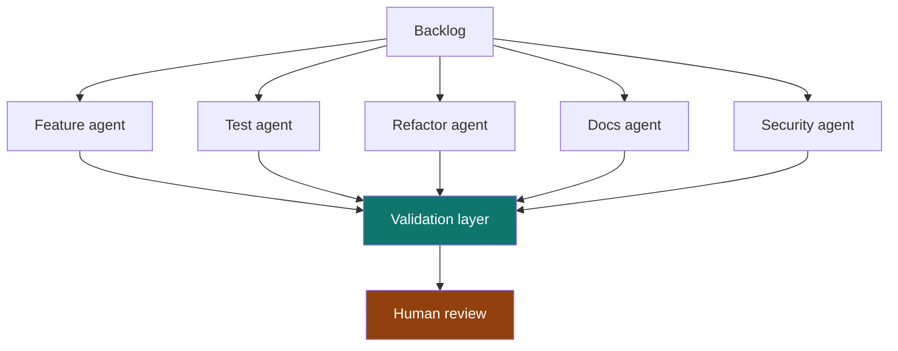
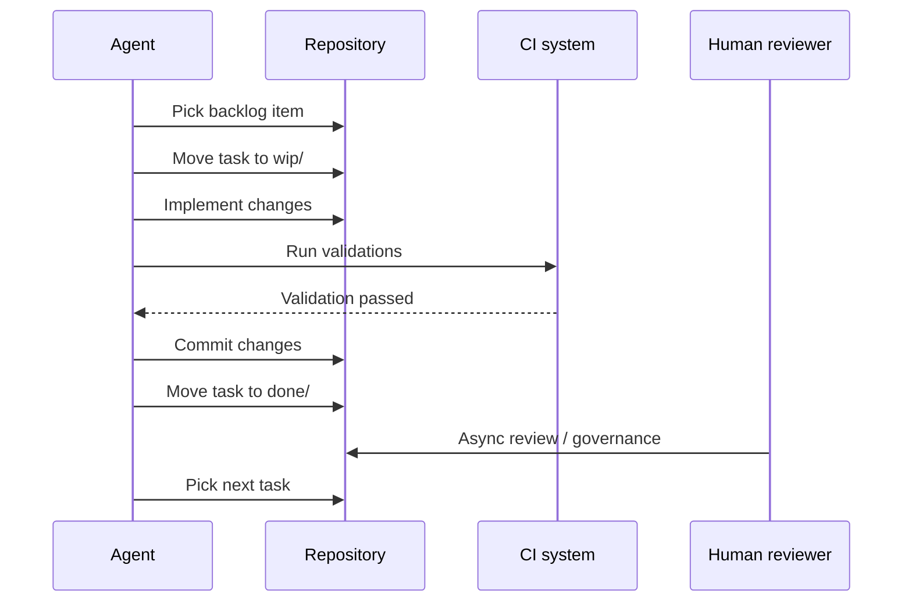

> What if the repository itself becomes the scheduler?

Most AI coding workflows are still session-driven:

```txt
Human -> Prompt -> Agent -> Stop
```

That is useful, but it treats the agent as a temporary chat participant. A repository can instead become a continuously evolving system where agents execute bounded work from persistent queues while humans remain reviewers, architects, and governors.

The operating model becomes closer to:

```txt
Human -> Governance -> Continuous Agent Runtime
```

## Core architecture

The repository itself becomes the orchestration layer.

```txt
repo/
├── src/
├── tests/
├── docs/
├── agent/
│   ├── backlog/
│   ├── wip/
│   ├── done/
│   ├── blocked/
│   ├── archive/
│   └── policies/
```

Each engineering task exists as a file:

```txt
agent/backlog/add-search-unit-tests.md
agent/backlog/remove-legacy-api-client.md
agent/backlog/improve-error-boundaries.md
```

This resembles Kanban because work is represented as visible items moving through explicit states. The difference is that git records those state transitions, so the queue becomes reviewable and recoverable.

## Agent runtime flow



The important part is not that the agent is autonomous. It is that the agent operates inside a state machine humans can inspect.

## Why filesystem Kanban?

Most orchestration systems eventually reinvent capabilities git already provides.

| Capability | Git already provides |
| --- | --- |
| Auditability | Commit history |
| Rollback | Git revert |
| Reviewability | Pull requests |
| Ownership | CODEOWNERS |
| Traceability | Commit SHA |
| Replication | Clone/fork |
| Automation | CI/CD |
| State transitions | File movement |

That means the queue itself becomes versioned, reviewable, reproducible, observable, and branchable.

## Task boundaries

A task file should be more than a title. It should define the boundary the agent is allowed to operate inside.

```md
# Task

Improve order page loading skeleton.

# Goal

Reduce perceived loading delay and improve CLS stability.

# Constraints

- No layout shift after hydration
- Must support static export
- Avoid client-only rendering

# Validation

bun run test
bun run typecheck
bun run build

# Ownership

frontend-platform

# Priority

P2
```

This gives the agent a bounded execution surface and gives reviewers a compact contract to audit.

## Human-auditable without blocking runtime

The difficult question is not whether agents can keep working. It is how humans stay involved without becoming the runtime bottleneck.

The answer is to move human responsibility toward policy, review, and exception handling.



| Role | Responsibility |
| --- | --- |
| Architect | Define boundaries |
| Reviewer | Audit changes |
| Governor | Control policies |
| Prioritizer | Feed backlog |
| Incident resolver | Handle blocked states |

The loop keeps moving, but humans keep control of the rules.

## Validation is the runtime controller

Agents are probabilistic. Validation is deterministic.

The system should shift trust away from:

```txt
trusting the agent
```

and toward:

```txt
trusting the validation system
```


This is where engineering quality actually lives: in checks, contracts, reviewable diffs, and rollback paths.

## Self-growing quality

One useful emergent property is that the repository can gradually improve itself through small queued tasks.

| Category | Example |
| --- | --- |
| Testing | Add missing edge-case tests |
| Refactoring | Remove dead abstractions |
| Types | Strengthen type safety |
| Performance | Reduce bundle size |
| Reliability | Improve retry logic |
| DX | Improve CI feedback |
| Observability | Add missing tracing |
| Docs | Keep docs synchronized |

This resembles compound interest more than traditional project delivery. The gains come from many validated micro-improvements rather than one large rewrite.

## Multi-agent topology

Specialization can emerge over time.



The topology should stay boring at first. A single worker with a strict queue is easier to govern than a swarm. Specialization only helps once validation, ownership, and review capacity are already strong.

## Failure modes

This system is not magic. Autonomy increases throughput, but it can also amplify mistakes.

| Risk | Description |
| --- | --- |
| Infinite loops | Agent repeatedly edits the same files |
| Validation gaming | Work optimizes only for CI passing |
| Repo churn | Commits become frequent but low-value |
| Context drift | Agent misunderstands architectural intent |
| Cost explosion | Token and runner usage become unbounded |
| PR overload | Reviewers cannot absorb the diff volume |
| False productivity | Activity increases without product value |

Governance matters more as autonomy increases.

## Minimal prototype stack

| Layer | Suggested choice |
| --- | --- |
| Queue | Filesystem Kanban |
| Runtime | Claude Code / Codex / OpenAI Agents |
| Validation | GitHub Actions |
| State | Git commits |
| Governance | CODEOWNERS and branch rules |
| Metrics | OpenTelemetry, ELK, Datadog, or Sentry |
| Isolation | Containerized runner |
| Scheduling | Cron or CI scheduler |

The first prototype does not need a complex control plane. It needs a small queue, a bounded worker, deterministic checks, and a clear rule for when humans review or stop the loop.



## Related work

Several nearby projects and papers point in the same direction. GitHub's [Agentic Workflows](https://github.com/github/gh-aw) experiments with work definitions that can be executed by agents, while GitHub Next's [Discovery Agent](https://githubnext.com/projects/discovery-agent/) explores repository-aware agents that investigate codebases. Microsoft's research on [YoloFS](https://www.microsoft.com/en-us/research/publication/dont-let-ai-agents-yolo-your-files-shifting-information-and-control-to-filesystems-for-agent-safety-and-autonomy/) argues that filesystem design can shift information and control toward safer agent autonomy.

The risks are also visible in current research. A study of [failed agentic pull requests](https://arxiv.org/abs/2601.15195) examines how autonomous coding attempts fail in practice, and [TDFlow](https://arxiv.org/abs/2510.23761) frames agentic work around test-driven feedback loops. The official [Kanban Guide](https://kanban.university/kanban-guide/) is useful background for the visualized workflow and WIP-control side of the model. [Backlog](https://backlog.so/) is another example of local files being used as an agent-friendly task orchestration surface.

## Final thought

The biggest unlock may not be smarter models. It may be designing repositories where autonomous engineering work can continue safely while humans are offline.

That turns software engineering from human-triggered execution into policy-constrained continuous evolution.
