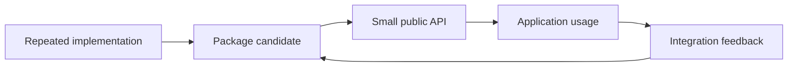
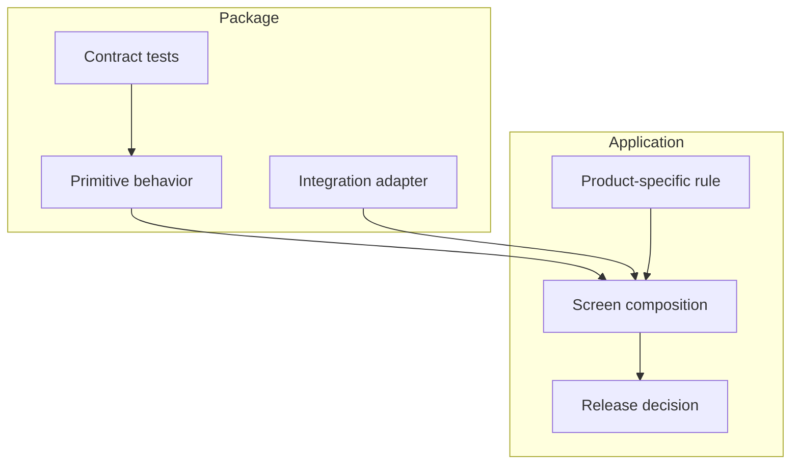

Internal packages create leverage when they remove repeated work without making every application depend on a hidden process.

## Lab question

What is the smallest shared package system that gives frontend teams leverage without turning every application into a dependency-management project?

This is a lab problem because the answer is not simply "extract common code." The interesting part is the boundary: which decisions should become shared primitives, which decisions should stay in the product application, and which feedback signals prove the package is helping rather than adding ceremony.

## Experiment design

The lab starts with repeated work, not architecture. Good candidates are easy to spot: authentication wrappers copied between apps, chart normalization repeated in dashboards, environment helpers rewritten per deployment target, or test utilities recreated because the last version lived too close to one product.

In a 2019 frontend stack, the packaging mechanics could be npm or Yarn, with a private registry such as Verdaccio, Nexus, Artifactory, or a hosted package service. The registry is only the distribution mechanism. The design work is deciding whether a package has a stable API, a testable behavior surface, and a versioning story that consumers can understand.

## Boundary sketch

The package should own boring, repeatable behavior: formatting, validation, request conventions, chart setup, logging shape, or browser compatibility helpers. The application should own product decisions: workflow order, permission meaning, copy, screen composition, and release timing.

That split keeps the shared code useful without making it mysterious. Consumers can upgrade a package because the API is small, the changelog is readable, and the semantic version says what kind of risk they are accepting. Package authors can improve internals because the contract is tested.

## What the lab tries to prove

The goal is not to maximize shared code. The goal is to reduce repeated decisions.

If the package works, a new application should need less setup to reach a consistent baseline. A chart should look and behave consistently without every team remembering the same options. A request helper should fail in a recognizable way. A test utility should make the intended behavior easier to express.

The useful output of the lab is a rule of thumb:

> Extract the decision only after the team can name the behavior, test the contract, and explain how consumers recover from a bad version.

That rule is stricter than "we copied this twice." It treats internal packages as product surfaces for other engineers, not just a place to put shared files.
