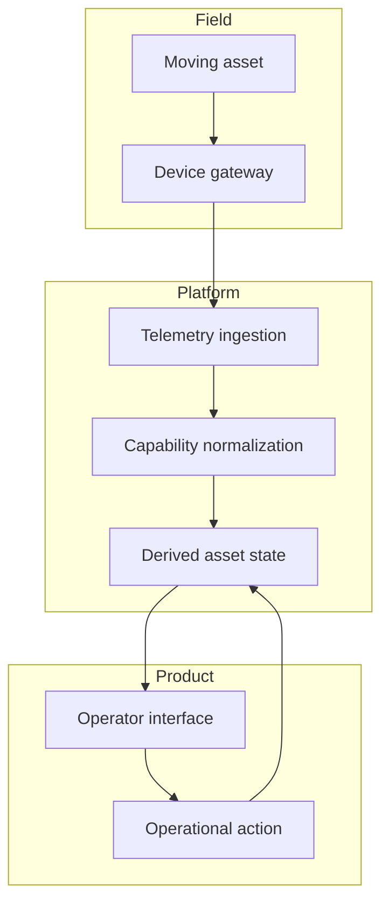

Cloud interfaces for moving assets need to treat location, connectivity, and device state as unstable inputs rather than static facts.

## System boundary

## Development concerns

The first mistake in this kind of interface is treating the asset as if it were a database row. A moving asset has a position, but that position has a freshness budget. It has a device state, but that state may be inferred from a heartbeat, a delayed batch, or a last-known message. It has a network path, but the path may be unavailable exactly when the operator most wants confidence.

That changes the frontend model. The UI should carry data freshness beside the value, not hide it in a tooltip. It should distinguish "unknown", "stale", "offline", and "not configured" instead of collapsing them into a generic error state. Those labels are product design, but they are also technical contracts between the frontend, backend, and telemetry pipeline.

For implementation, I would model moving assets through derived view models instead of binding raw device payloads directly into components. The raw payload can preserve transport-specific details, while the view model gives the UI stable fields: identity, last observed position, last observed time, connectivity state, category, and available actions. That separation keeps rendering code from learning too much about device protocols.

| Concern | Development implication |
| --- | --- |
| Location changes continuously | Render freshness and confidence, not only coordinates. |
| Connectivity is intermittent | Make missing updates a first-class state. |
| Device families differ | Normalize capabilities before the component layer. |
| Operators scan under pressure | Prioritize status hierarchy over decorative detail. |

## Durable pattern

In a 2016-era web stack, this could still be implemented with plain REST endpoints, Rails-backed JSON APIs, Knockout view models, Angular components, or a mix of polling and WebSocket updates. The tool choice matters less than the contract: every moving-asset UI needs a vocabulary for uncertainty. Once that vocabulary exists, the system can show users what it knows, what it does not know, and what is still safe to do.
