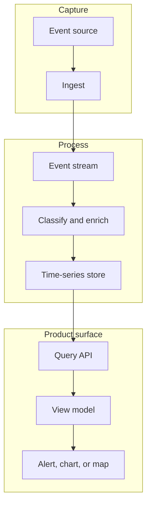

Event pipelines become part of the user experience when the interface depends on what happened, when it happened, and whether the system can explain it.

## Pipeline shape

## Development concerns

Event data becomes user experience when the interface depends on event order, freshness, and interpretation. A chart, alert list, or map marker is not just rendering data. It is presenting a claim that something happened and that the system understands enough to show it.

The development challenge is usually between raw event fidelity and product usefulness. Raw event streams preserve details that are important for debugging and analytics, but user interfaces need stable semantics: event type, observed time, affected asset, severity, confidence, and whether the event is actionable. That mapping should happen deliberately, not as scattered component logic.

When the frontend queries time-series or event data directly through an API, the query contract matters. Pagination, time ranges, deduplication, timezone handling, and null fields all shape user trust. If the UI silently drops malformed events, users see absence. If it shows every raw edge case, users see noise. The product needs a middle layer that turns event data into understandable state.

| Pipeline layer | UX responsibility |
| --- | --- |
| Ingestion | Preserve enough source detail to debug missing or delayed events. |
| Stream processing | Attach consistent event meaning and severity. |
| Storage/query | Make time windows and filters predictable. |
| UI rendering | Explain freshness, empty states, and actionability. |

## Durable pattern

By 2018, it was common for operational products to combine stream processing, Kafka-style event transport, Druid or Elasticsearch-style analytical queries, and dashboard layers built with Chart.js, D3, or custom map views. The reusable point is that event pipelines are not backend-only infrastructure. They determine whether the frontend can make credible statements about operational reality.
