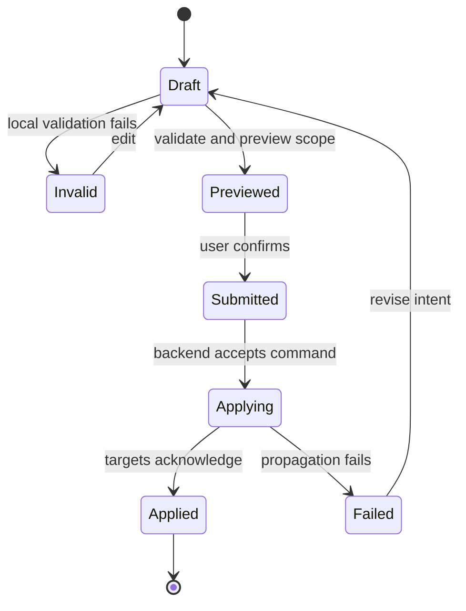

Configuration interfaces for distributed systems need to make change understandable before they make change easy.

## Configuration lifecycle

## Development concerns

Configuration UIs are risky because they turn human intent into distributed behavior. A button can change how devices report, how alerts fire, or who receives operational messages. The interface cannot treat that as a simple form submission.

The main development concern is making scope visible. Before applying a change, users need to know what objects are affected, which rules are being changed, whether required fields are complete, and what the system will do next. The UI should provide validation, preview, and confirmation based on the consequences of the change rather than the shape of the form.

For implementation, this usually benefits from a draft model. The UI edits a local draft, validates it against a typed contract, previews impacted targets, and only then sends a command. After submission, the UI should not immediately imply success unless the backend has confirmed propagation or at least accepted the job. In distributed systems, "saved" and "applied" are different states.

| UI state | Meaning |
| --- | --- |
| Draft | The user is editing intent that has not affected the system. |
| Validated | The system can understand the requested change. |
| Submitted | The change request has been accepted for processing. |
| Applied | The affected targets have observed or acknowledged the change. |
| Failed | The system can explain where the change stopped. |

## Durable pattern

The useful implementation pattern is the same whether the stack uses Rails, Node.js, Java services, or a message queue behind the API: separate editing from applying. A configuration UI should model drafts, validation, submission, propagation, and observation as different product states because users experience those states differently.
