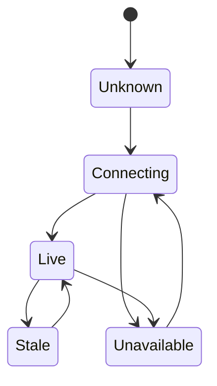

Frontend work near hardware has to represent reality without pretending the browser controls it.

## Boundary assumptions

| Frontend assumption | Hardware and network reality |
| --- | --- |
| Data arrives in request order. | Device data may be delayed, missing, or replayed. |
| Errors are application states. | Errors may come from coverage gaps, power, or physical conditions. |
| Refreshing is harmless. | Refreshing can hide state-machine or stream setup problems. |
| UI state is local. | UI state often reflects remote systems still converging. |

## Development concerns

Hardware-adjacent frontend work forces the browser to represent systems it does not control. The UI can request a stream, draw a map marker, or submit a configuration, but it cannot guarantee radio coverage, device power, sensor health, or clock accuracy.

That should change the way components are designed. Instead of optimistic assumptions, the UI needs explicit uncertainty. A map marker can have last-known time. A camera tile can separate stream setup from media availability. A sensor reading can show whether it is fresh, stale, or outside expected range. These are not decorative labels. They are how the product tells the truth.

The development architecture should avoid spreading hardware conditions across many components. A better shape is to normalize raw device and network signals into a small set of UI states. Components then render those states consistently, and tests can cover the state matrix without reproducing the entire external system.

## State model sketch

## Durable pattern

The engineering posture is simple: frontend code near hardware should be humble, explicit, and observable. Whether the UI is written in Angular, React, Knockout, or plain JavaScript, the browser should not pretend it has stronger guarantees than the device, network, and stream pipeline can provide.
