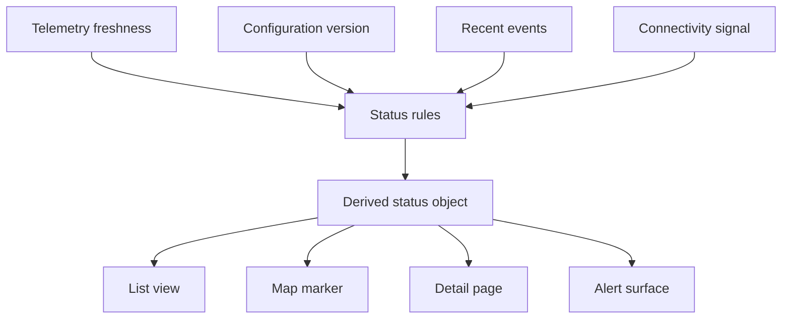

Device status becomes a product surface when people use it to decide what to trust, inspect, and change next.

## Status derivation

## Development concerns

Device status is an interpretation layer. A backend may know many facts about a device: last message time, firmware version, connectivity result, configuration version, location, and recent events. A user needs a smaller answer: is this device healthy, does it need attention, and what can I do next?

The product surface sits between those two worlds. It should preserve technical nuance where it matters, but it should not force every operator to inspect raw telemetry. This usually means building derived statuses with clear rules, then making the rules visible enough that users trust the result.

For frontend development, the important artifact is the status contract. Components should receive a status object that includes label, severity, freshness, explanation, and available actions. That contract makes it easier to render lists, detail pages, maps, and alerts consistently.

| Status field | Why it matters |
| --- | --- |
| Label | Gives the user a scan-friendly state. |
| Severity | Helps prioritize attention. |
| Freshness | Prevents stale data from looking current. |
| Explanation | Makes derived state auditable. |
| Available actions | Connects status to operational next steps. |

## Durable pattern

Status is a product API, not just a database projection. Time-series stores, caches, search indexes, and stream processors can all feed the state, but the user-facing contract should remain stable: what is happening, how fresh is the signal, why does the system think so, and what can be done next.
