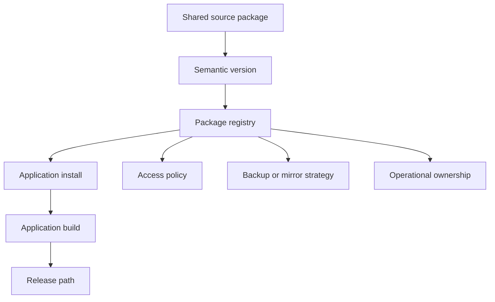

Private package registries start as developer convenience and become infrastructure when product builds cannot move without them.

## Dependency topology

## Development concerns

A private package registry often begins as an efficiency tool. A team extracts authentication helpers, UI utilities, chart wrappers, or environment glue into shared packages so applications can move faster. The moment production builds depend on that registry, it becomes infrastructure.

That shift changes the engineering requirements. Access needs to be documented. Ownership needs to be clear. Builds need to be reproducible when someone changes machines, networks, or deployment environments. Package publishing needs versioning discipline so one team does not break another team by accident.

The frontend concern is not only installation. Shared packages shape application architecture. If a package owns too much product behavior, every consuming app inherits hidden coupling. If it owns too little, it becomes a thin wrapper that adds release overhead without real leverage. The useful boundary is usually a stable utility or primitive with a small API and clear compatibility expectations.

## Registry as infrastructure

| Infrastructure concern | Package-registry equivalent |
| --- | --- |
| Availability | Can applications install dependencies when they need to build? |
| Access control | Can the right people and systems read or publish packages? |
| Disaster recovery | Can packages be restored or mirrored if the registry is unavailable? |
| Observability | Can the team identify publish, install, and version issues quickly? |

## Durable pattern

npm, Yarn, Verdaccio, Artifactory, Nexus, and cloud-hosted registries all make package sharing feel routine, but the operating model still matters. Developer convenience becomes product infrastructure when releases depend on it.
