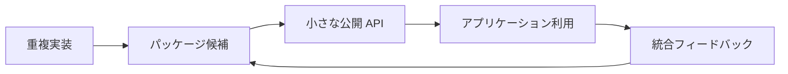
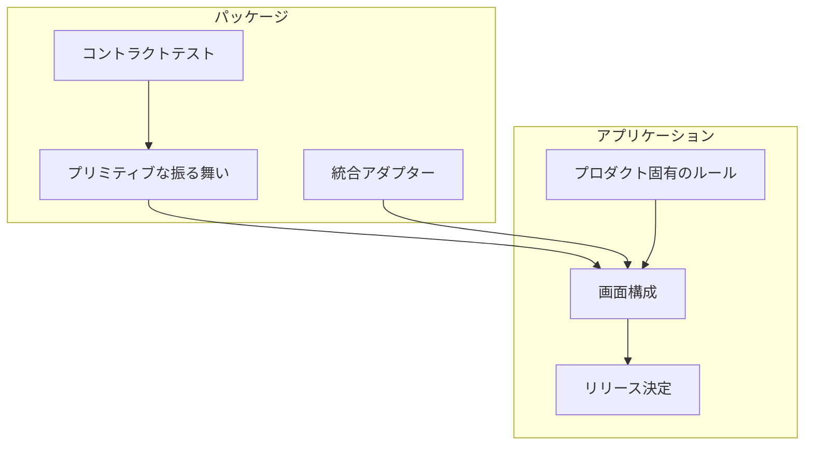

内部パッケージが梃子になるのは、重複作業を取り除くことで実現する。すべてのアプリケーションが隠れたプロセスに依存することによってではない。

## ダイジェストの問い

フロントエンドチームが梃子を得られる最小限の shared package system とは何か。そして、すべてのアプリケーションを dependency-management プロジェクトにしてしまわないためには？

これがダイジェストの問いである。答えは単純に「共通コードを抽出する」ことではないからだ。興味深い部分は境界にある：どの意思決定が shared primitive になるべきか、どれがプロダクトアプリに留まるべきか、そしてパッケージが儀式を増やすのではなく実際に助けになっていることを証明する feedback signal は何か。

## 実験設計

ダイジェストはアーキテクチャからではなく、重複作業から始まる。良い候補は見つけやすい：アプリ間でコピーされた authentication wrapper、ダッシュボードで繰り返される chart normalization、デプロイターゲットごとに書き直される environment helper、前バージョンが特定のプロダクトに近すぎたため再作成された test utility など。

2019 年の frontend stack では、パッケージの仕組みは npm か Yarn で、registry は Verdaccio、Nexus、Artifactory、またはホスト型パッケージサービスが使われた。Registry はディストリビューションの仕組みに過ぎない。真の設計作業は、パッケージに安定した API があるか、テスト可能な behavior surface があるか、そしてコンシューマーが理解できる versioning story があるかを判断することだ。

## 境界スケッチ

パッケージは退屈で繰り返し可能な振る舞いを持つべきだ：formatting、validation、request conventions、chart setup、logging shape、browser compatibility helpers など。アプリケーションはプロダクトの意思決定を持つべきだ：workflow order、permission meaning、copy、screen composition、release timing。

この分割が shared code を神秘的でなく有用にする。コンシューマーは API が小さく、changelog が読みやすく、semantic version がどのリスクを受け入れるかを伝えているのでパッケージをアップグレードできる。パッケージ作者はコントラクトがテストで守られているので内部を改善できる。

## このダイジェストが証明しようとすること

目標は shared code を最大化することではない。目標は重複する意思決定を減らすことだ。

パッケージが機能するなら、新しいアプリケーションは一貫した baseline に到達するためにより少ないセットアップで済むはずだ。チャートは各チームが同じオプションを覚えることなく一貫して見た目と動作が揃うべきだ。Request helper は認識可能な方法で失敗するべきだ。Test utility は意図した振る舞いをより簡単に表現できるべきだ。

このダイジェストの有用な出力は一つの経験則だ：

> チームが振る舞いに名前をつけ、コントラクトをテストし、コンシューマーが悪いバージョンからどう回復するかを説明できて初めて、その意思決定を抽出する。

これは「2 回コピーした」よりも厳格だ。内部パッケージを shared files を置く場所ではなく、他のエンジニア向けのプロダクトサーフェスとして扱う。
