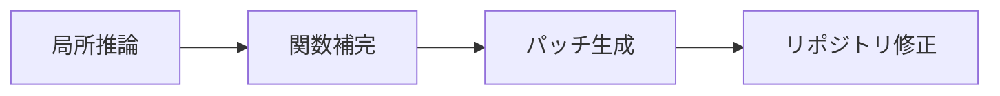
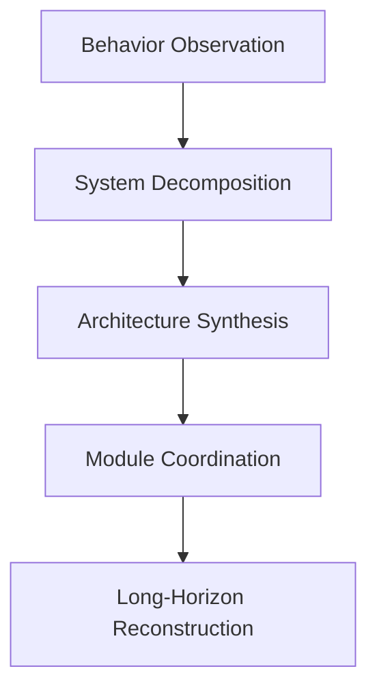
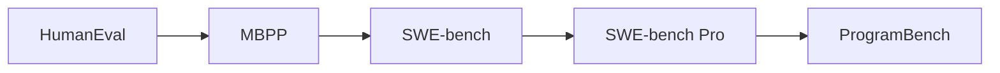
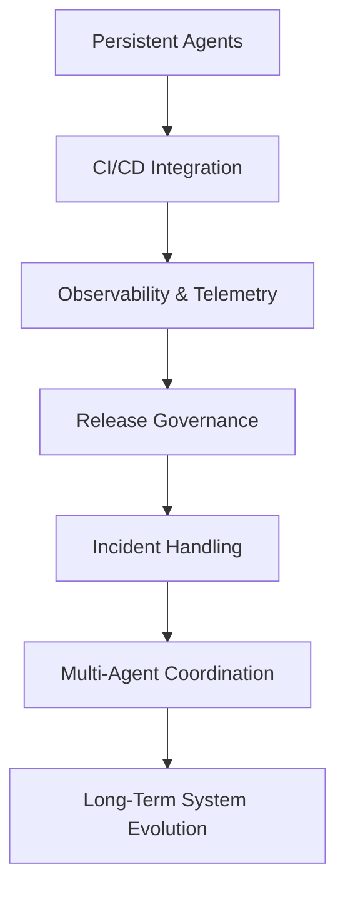

_「コードが書ける」ことはもはや正しい問いではない_

過去数年、AI コーディングの議論はシンプルな物語を中心に展開してきた：

> モデルはコードを書くのが上手くなっている。

HumanEval、MBPP、SWE-bench のようなベンチマークがこのフレーミングを強化してきた。

しかし最近リリースされた **ProgramBench** の論文を読んで、業界がより重要なトランジションに近づいているのではないかと思い始めた。

なぜなら ProgramBench は主に次を問わないからだ：

```text
AI はコードが書けるか？
```

代わりに問うのは：

```text
AI はソフトウェアシステムを再構築・設計できるか？
```

この違いは巨大だ。

## コード生成からシステム再構築へ

既存リポジトリのパッチングに焦点を当てる SWE-bench とは異なり、ProgramBench はソースコードの基盤全体を取り除く。

ベンチマークがモデルに与えるのは：

- 実行可能なバイナリ
- CLI の振る舞い
- README とドキュメント

しかし **提供しない** のは：

- ソースコード
- インターネットアクセス
- デコンパイラ

エージェントはゼロからソフトウェアシステムを再構築しなければならない。

それには以下が含まれる：

- アーキテクチャ
- モジュール
- 抽象化
- インターフェース
- ランタイムの振る舞い
- ビルドシステム
- エッジケースの処理

そして重要なのは：

> 評価は実装の等価性ではなく、振る舞いの等価性に基づく。

つまり、再構築されたシステムは観測可能な振る舞いが一致する限り、内部実装が元と異なっていても合格できる。

これが今日のほとんどのコーディング評価と本質的に異なる点だ。

## ProgramBench が違って感じられる理由

現代のコーディングベンチマークの多くは依然として本質的に次を測定する：



ProgramBench は代わりにより近いものを測定する：



これは議論を：

- コーディング支援

から：

- システムエンジニアリング

へと移す。

この違いは現在のベンチマーク議論が認めているよりも重要だと思う。

## 最も興味深い結果はモデルがどう失敗するか

論文のヘッドラインの結果はフロンティアモデルが驚くほど低いパフォーマンスを示すことだ。

しかしより重要な洞察は *どのように* 失敗するかだと思う。

論文はモデルが以下に傾く傾向を繰り返し観察している：

- モノリシックな実装
- 過大な単一ファイル設計
- 弱い抽象化
- 不十分なモジュール分解
- 限られたアーキテクチャの層化

これは最近の AI コーディング研究で見た中で最も示唆的な観察の一つだ。

なぜなら、より深いことを示唆しているから：

> 現在のフロンティアモデルは既存のアーキテクチャを修正することは非常に得意だが、堅牢なアーキテクチャを発明することは非常に苦手だ。

これは非常に重要な違いだ。

## リポジトリ寄生の観察

私が現代のコーディングエージェントを解釈する一つの方法はこうだ：

アーキテクチャが既に存在するとき、非常に有能になる。

以下が揃っているとき：

- リポジトリ構造
- 規約
- CI
- テスト
- 所有権パターン
- モジュール境界

AI システムは以下において非常に効果的だ：

- パッチング
- 拡張
- リファクタリング
- 最適化

しかしそれらの構造が消えると、能力は劇的に低下する。

これは現在のフロンティア AI が次のように振る舞うことを示唆する：

```text
非常に有能なメンテナンスエンジニア
```

よりも：

```text
真のシステムアーキテクト
```

ではないと。

そしてこれは、多くのエンジニアが実際に直感的に観察していることと非常に一致する。

## モノリシック生成が起きる理由

この振る舞いは偶然だとは思わない。

LLM は根本的にトークン列の継続によって動作する。

これはモデルに以下への偏りをもたらす：

- 線形拡張
- 局所的な一貫性
- 近傍の最適化

しかしソフトウェアアーキテクチャはほぼ逆を要求する：

- 将来の拡張性
- 遅延計画
- 関心の分離
- 抽象化の境界
- インターフェースの規律
- 非局所的な推論

これらは自己回帰的な生成システムには本質的に困難だ。

そのため多くの AI 生成システムは次のように感じられる：

```text
技術的には機能するが、アーキテクチャ的に不自然
```

コードは実行されるかもしれない。テストは通るかもしれない。しかしシステム構造には、人間エンジニアが自然に適用する意図的な分解が欠けていることが多い。

## ベンチマークの進化

ProgramBench は AI エンジニアリング能力の評価における、より広いシフトも反映している。

大まかにこう見える：



各段階で抽象度が上がっている。そしてこれは重要なことを反映している：

最も困難なエンジニアリングの問題は通常：

- 構文の問題
- アルゴリズムの問題
- 局所的な実装の問題

ではなく：

- システム設計の問題
- 調整の問題
- ライフサイクルの問題
- 複雑性管理の問題

だ。

## ソフトウェアエンジニアリングはコーディングではない

これが最終的にこの論文の最も重要な哲学的含意だと思う。

ソフトウェアエンジニアリングはコード生産を主とするものではなかった。常に：

- 複雑性の管理
- 制約の処理
- 保守性
- 時間をかけた進化

についてだった。

ソフトウェアシステムは以下の中に存在する：

- 組織
- リリースプロセス
- デプロイパイプライン
- オブザーバビリティシステム
- 運用経済
- 所有権構造

従来のコーディングベンチマークはこれをほとんど捉えない。

ProgramBench は以下を導入することでその方向に動き始めている：

- 曖昧さ
- 再構築
- 長期的な推論
- アーキテクチャ形成

しかしこのベンチマークでさえ、実世界のエンジニアリングの一部しか捉えない。

## ProgramBench がまだ測定しないこと

これまで見た中で最も強力なベンチマークの一つであるにもかかわらず、いくつかの重要な次元がまだ欠けている。

### 1. 組織的制約

実際のエンジニアリングには以下が含まれる：

- プロダクト交渉
- リリース圧力
- ロールバック計画
- ガバナンス
- セキュリティレビュー
- 運用リスク

ベンチマークはこれらの次元をまだほとんど無視している。

### 2. 長期的な保守性

今日テストが通ることは、6 か月後もシステムが保守可能であることを意味しない。

本当のアーキテクチャ品質は以下を通じて現れる：

- 拡張性
- 運用のシンプルさ
- 将来の反復コスト
- 障害の分離

これはベンチマークするのが非常に難しい。

### 3. 人間の調整

大規模なソフトウェアエンジニアリングは本質的にコラボレーティブだ。

多くのアーキテクチャの意思決定は理論的に最適だからではなく、以下の理由で存在する：

- 調整のオーバーヘッドを減らす
- チームのスケーラビリティを高める
- 所有権を明確にする

現在のベンチマークは孤立したエージェントを評価し、社会技術的なシステムは評価しない。

## AI エンジニアリング評価の将来の方向

ProgramBench はより大きなトランジションの始まりを表していると思う。

将来のベンチマークは以下を評価する方向に進化するかもしれない：



その時点で：

> ベンチマーク自体が単なるモデルの問題ではなく、ソフトウェアプラットフォームの問題になる。

そしてそのシフトはすでに始まっていると思う。

## 最後の考察

ProgramBench は微妙だが重要なことを明らかにする：

> AI システムはソフトウェアを修正することには能力が近づいているが、ソフトウェアエンジニアリングシステムをマスタリングするにはまだ遠い。

このギャップは非常に重要だ。

なぜなら最も高いレバレッジのエンジニアリング作業は主に：

- 構文を書く
- ボイラープレートを生成する
- 実装を埋める

ことではなかったから。

それは：

- システムを形作る
- 複雑性をコントロールする
- 将来の進化を可能にする
- 時間をかけて人間とマシンを調整する

ことだった。

そして ProgramBench はこの境界を明確に露わにした最初のベンチマークの一つとして記憶されるかもしれない。

## 参考文献

1. ProgramBench: *Can Language Models Rebuild Programs From Scratch?*  
   [https://arxiv.org/abs/2605.03546](https://arxiv.org/abs/2605.03546)

2. ProgramBench PDF  
   [https://arxiv.org/pdf/2605.03546](https://arxiv.org/pdf/2605.03546)

3. SWE-bench  
   [https://www.swebench.com/](https://www.swebench.com/)

4. SWE-bench Pro  
   [https://arxiv.org/abs/2509.16941](https://arxiv.org/abs/2509.16941)
