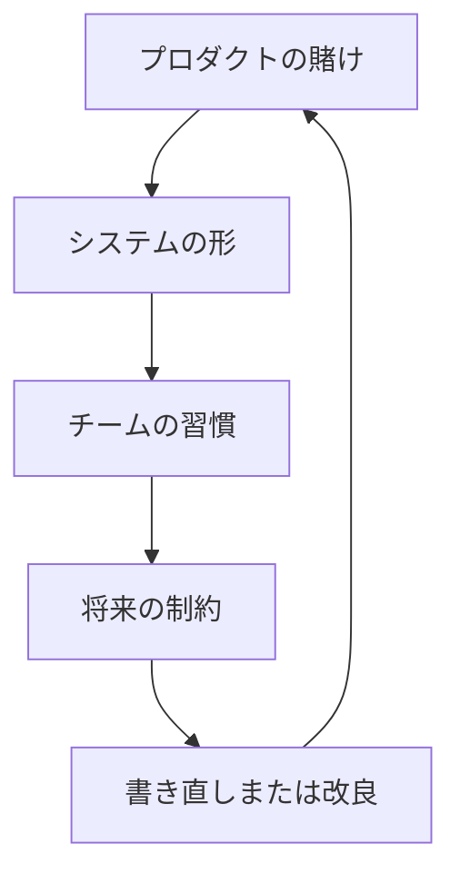

長期プロダクトは蓄積を通じて教える：すべてのアーキテクチャの選択、チームの変化、市場への賭けが痕跡を残す。

## プロダクトは覚えている

長期プロダクトの不思議なことは、チームが忘れた後もプロダクトが意思決定を覚えていることだ。ルート境界、ステータス名、チャート抽象化、retry の振る舞い、パッケージ規約が、いくつかのスタッフィングや計画変更を生き延びることがある。コードは古い仮定を持ち続ける。

それが自動的に悪いわけではない。古い仮定の中にはプロダクトの知恵もある。アーキテクチャになったショートカットもある。難しいのは、すべてを書き直す前にどちらかを見極めることだ。

## 名前が荷重を持つ

最初の教訓は、命名は見かけ以上に重要だということだ。プロダクトがデバイスの状態、イベントタイプ、設定スコープ、所有権境界に名前をつけられないなら、コードは同じものに対して複数の名前を作り出す。それらの名前が API、ダッシュボード、テスト、インシデント言語、オンボーディングの会話に染み出していく。

これはフロントエンドとプラットフォームの仕事が静かに交わる場所だ。インターフェースのラベルがサポートが使う用語になるかもしれない。ステータス enum が API コントラクトになるかもしれない。チャートのグルーピングがマネージャーがシステムを理解する方法になるかもしれない。命名はアーキテクチャの後のポリッシュではない。アーキテクチャの一部だ。

## プラットフォームは場所ではない

2 つ目の教訓は、プラットフォームの仕事はインフラだけではないということだ。フロントエンドのコンポーネントライブラリ、ステータスモデル、パッケージ規約、デプロイチェック、デバッグプレイブックは、他のチームがその上に構築するならプラットフォームの仕事になり得る。

2019 年頃は、複数世代のフロントエンドアーキテクチャと共存することがよくあった：古い Knockout や AngularJS のパターン、Angular や React コンポーネント、Rails や Node.js API、npm パッケージ、CI スクリプト、Chart.js や D3 のような公開ライブラリで作ったダッシュボード。技術リストより重要なのは効果だ：別のチームがあるサーフェスに依存すると、そのサーフェスはプラットフォームの責任を持つ。

## ドラマなしの変化

3 つ目の教訓は、書き直しだけが技術的変化の形ではないということだ。プロダクトは互換性レイヤー、抽出されたユーティリティ、より良いルート境界、より明確なステートモデル、より厳密なバリデーション、よりオブザーバブルなリリースパスを通じて進化できる。これらの変化は書き直しほどドラマチックではないが、リスクを減らしながらデリバリーを保持することが多い。

長期プロダクトは次のリリースだけのために最適化した設計を罰する。古いすべての決定を間違いとして扱うチームも罰する。より良い姿勢は、プロダクトが何を学んだか、その学習のどの部分がよりクリーンなインターフェースに値するかを問うことだ。

フレームワークは変わる。難しい問いは残る：プロダクトはどんな状態を公開するか、どのコントラクトが安定したままでいるか、shared code はどこに住むべきか、そしてチームはシステムがまだ真実を語っていることをどうやって知るか。
