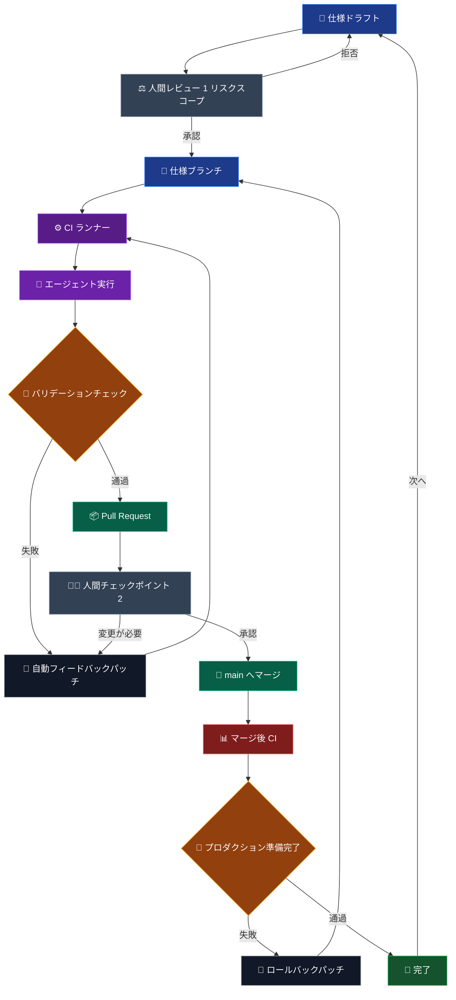

これはエージェントを使いながらエンジニアリング判断を手放さないための仕様優先デリバリーループだ。

有用な部分は、エージェントが素早くコードを書けることではない。有用な部分は、リスク・バリデーション・所有権が可視化されたままで、仕事が明確なチェックポイントを通過することだ。

## 動作ループ

## 最初のレビューが重要な理由

最初の人間チェックポイントはコードレビューではない。リスクスコープのレビューだ。

エージェントが始まる前に、仕様はブラストラジアスを可視化すべきだ：何が変えられるか、何が変えてはいけないか、そして仕事が受け入れ可能であることを証明するチェックは何か。この段階での拒否はまだ実装が生み出されていないので安価だ。

## エージェントが入る場所

エージェントの実行は CI の代わりになるのではなく、CI の後ろに立つ。

エージェントはパッチし、再実行し、バリデーションフィードバックに応答できるが、そのループはテスト・型チェック・ビルド出力・レビュー可能な diff によって制約される。これによってスピードが信頼に結びつく。

## 2 つ目のチェックポイントがある理由

Pull Request チェックポイントは、人間が結果が保守可能かどうかを判断する場所だ。通過するかどうかだけでなく。

変更に調整が必要なら、フィードバックパッチループに戻る。承認されたら `main` にマージし、マージ後のバリデーションを独立したプロダクション準備ゲートとして使う。

## 完了は一時的な状態

このループは次の仕様ドラフトに戻ることで終わる。

それが重要なのは、エージェントエンジニアリングが一発生成のイベントではないからだ。レビュー・ロールバック・プロダクションチェックを保持しながらデリバリーを動かし続ける方法だ。それがソフトウェアを信頼できるものに保つ。
