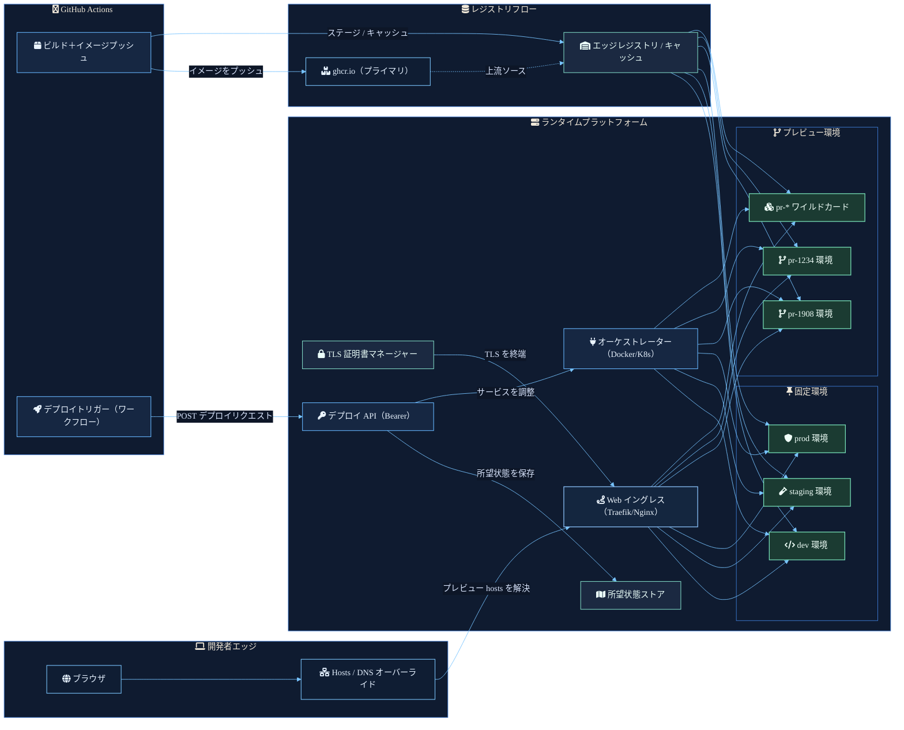

プレビュー環境を運用しやすくするには、ワークフローを明確な責任に分割する必要がある。

ブラウザはターゲットが長期の dev 環境か短命の pull request 環境かを知る必要はない。GitHub Actions はイングレスルールがどう適用されるかを知る必要はない。ランタイムは実行中のコンテナから配備の意図を推測すべきではない。それぞれの部分は狭い仕事を持つ必要がある。

## リクエストパス

開発者エッジはローカル解決から始まる。ブラウザのリクエストは hosts ファイルまたは DNS オーバーライドを通り、プラットフォームのイングレスに着地する。これによってプレビューのホスト名がローカルマシンとコンテナの配置を結びつけることなく明確な入り口になる。

## アーティファクトパス

GitHub Actions はイメージをビルドし、プライマリソースとして `ghcr.io` にプッシュする。エッジレジストリやキャッシュはイメージをランタイムプラットフォームの近くにステージングし、固定環境と動的環境の両方が同じローカルアーティファクトパスから取得できるようにする。

## コントロールパス

デプロイワークフローは bearer 保護された deploy API を呼び出す。その API はオーケストレーターにサービスの調整を求める前に所望の状態を記録する。重要な境界は、デプロイの意図がランタイムの副作用とは別に保存されることだ。

## ランタイムパス

オーケストレーターは `dev`、`staging`、`prod` のような固定環境の候補と、`pr-1908` や `pr-1234` のような動的プレビュー環境の両方を調整する。TLS はイングレス層で終端し、ゲートウェイは要求されたホスト名を現在満たしている環境にトラフィックをルーティングする。

結果は URL・イメージ・所望の状態・サービスの調整が独立してデバッグできるほど分離されているが、単一のデプロイフローで繋がれているプレビューシステムだ。
