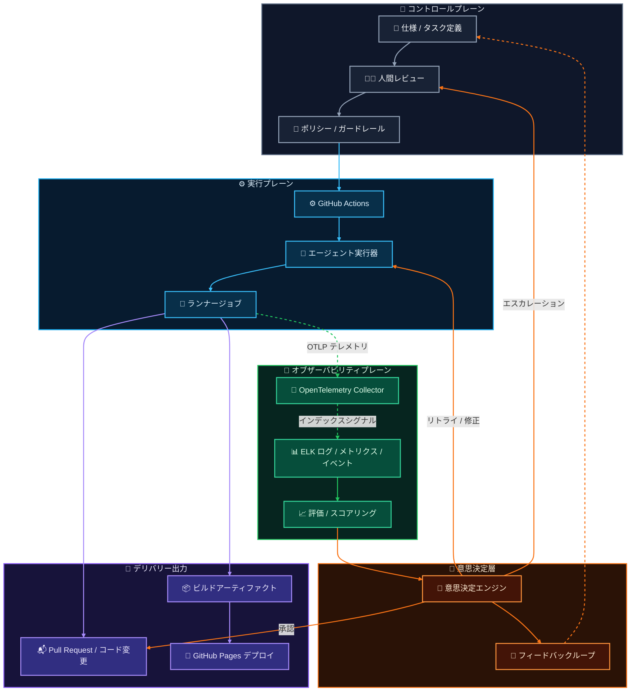

このモデルは単なる `CI -> deploy` でも `agent -> pull request` でもない。

ガバナンスをプレーンに分離する。コントロールプレーンは意図とガードレールを定義する。実行プレーンはコードとアーティファクトを生み出す。オブザーバビリティプレーンは何が起きたかを記録する。意思決定層はテレメトリとレビューシグナルを承認・リトライ・エスカレーション・フィードバックに変換する。

## 実行チャネル

実行チャネルは決定論的に保たれる：

`仕様 -> 人間レビュー -> ポリシー -> GitHub Actions -> エージェント実行器 -> ランナージョブ -> ビルドアーティファクト -> GitHub Pages デプロイ`

このパスは状態変化を担当する。レビュー済みのタスクが実行可能かどうか、ランナーがコード変更またはアーティファクトを生み出したかどうか、静的サイトのアーティファクトが GitHub Pages に到達できるかどうかを判断する。

## オブザーバビリティチャネル

オブザーバビリティチャネルはサイドバンドだ：

`ランナージョブ -> OpenTelemetry Collector -> ELK -> 評価 / スコアリング`

ジョブはログ・メトリクス・トレース・イベントを OTLP テレメトリとして送出する。コレクターはそのシグナルを正規化し、ELK にインデックス・検索・ダッシュボード・調査のために転送する。評価はそのレコードを実行スコア・異常シグナル・パイプラインランキング入力に変換する。

## 意思決定ループ

意思決定層はオブザーバビリティをデプロイ依存にすることなく評価出力を消化する。

pull request を承認し、エージェントに修正付きでリトライを要求し、人間のレビュアーにエスカレーションし、あるいは教訓を次のタスク定義にフィードバックできる。これがエージェント的な仕事にループを有用にする：判断は明示的に保たれ、リトライは有界に保たれ、システムはどのジョブとパイプラインが信頼に値するかについての証拠を蓄積する。

## ガバナンスルール

デプロイはログの成功に依存すべきではない。

テレメトリの取り込みが遅延しているか ELK が利用できない場合でも、ビルドパスは自身のチェックに基づいて完了または失敗できるべきだ。オブザーバビリティは何が起きたかを説明し、実行を比較し、異常を検出し、事後にパイプラインをスコアリングまたはランキングするためにある。

この分離は GitHub Actions をデリバリーの責任者に保ち、OpenTelemetry と ELK を診断レコードにする。結果は実行が決定論的に保たれ、診断がジョブレベルのトレーサビリティ・異常検出・評価・パイプラインガバナンスをサポートするのに十分なほど豊かな CI システムだ。
