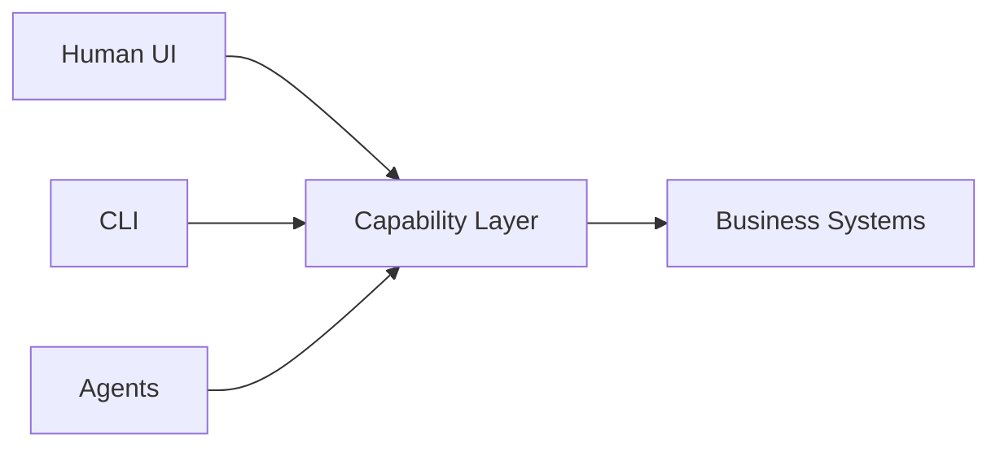

最近、[Microsoft Research の WebWright 記事](https://www.microsoft.com/en-us/research/articles/webwright-a-terminal-is-all-you-need-for-web-agents/) を読んだ。

これは単なる browser automation の研究ではなく、もっと本質的な問いを投げかけていると思う。

> Browser Agent に本当に Browser UI は必要なのか？

## 現在の Browser Agent の問題

多くの Web Agent は以下のような構成になっている。

```text
LLM
 ↓
Playwright / Puppeteer
 ↓
Browser UI
 ↓
DOM / Screenshot / OCR
```

しかし、この方式には典型的な問題がある。

* screenshot token cost が高い
* DOM が noisy
* automation が flaky
* state 管理が難しい
* context が巨大化する
* 実行速度が遅い

実際、多くの場合 Agent は「画面を見る」必要はない。

必要なのは：

> 構造化された操作可能 state

である。

## WebWright の核心

WebWright は Browser を GUI として扱わない。

代わりに：

```text
Terminal Interface
```

として抽象化する。

つまり：

* screenshot 不要
* cursor reasoning 不要
* visual understanding 不要

代わりに：

```text
Agent ↔ Structured Web Environment
```

という形になる。

これは Browser Automation というより：

```text
Web Runtime
```

に近い。

## 本当に解決していること

### 1. Token Cost の削減

Visual reasoning は非常に高コスト。

特に enterprise system：

* CMS
* ERP
* CRM
* internal dashboard

などでは、UI は repetitive で state-driven。

Agent に必要なのは pixel 理解ではなく：

* action
* state
* workflow transition

である。

### 2. Ambiguity の削減

現在の Web UI は：

```text
Human-friendly
```

だが：

```text
Agent-friendly
```

ではない。

Terminal-style interaction は：

* deterministic
* semantic
* structured

な execution を可能にする。

### 3. Determinism の向上

GUI automation は非常に壊れやすい。

例えば：

* animation
* overlay
* lazy render
* responsive layout

など。

WebWright は：

```text
Semantic Interaction Layer
```

を導入しているとも言える。

## より大きな変化

重要なのは：

> 「terminal が browser を操作する」

ことではない。

本質は：

> Web の再抽象化

である。

過去：

```text
Human-first Web
```

これから：

```text
Agent-first Web
```

へ。

## 将来的な構成



UI は唯一の入口ではなくなる。

Agent は直接：

* workflow
* forms
* state
* capabilities

を操作する。

## Frontend Architecture への影響

今後は：

```text
UI Layer
Capability Layer
Agent Layer
Automation Layer
```

の分離が重要になる。

そして最終的には：

> UI は capability の renderer の一つになる。

## 結論

WebWright が最終解ではないかもしれない。

しかし、重要な方向性を示している。

> Browser は人間専用ではなくなる。

これから Browser は：

```text
Agent Runtime
```

になっていく。

これは：

* frontend engineering
* DevOps
* enterprise workflow
* automation

そのものを変える可能性がある。
