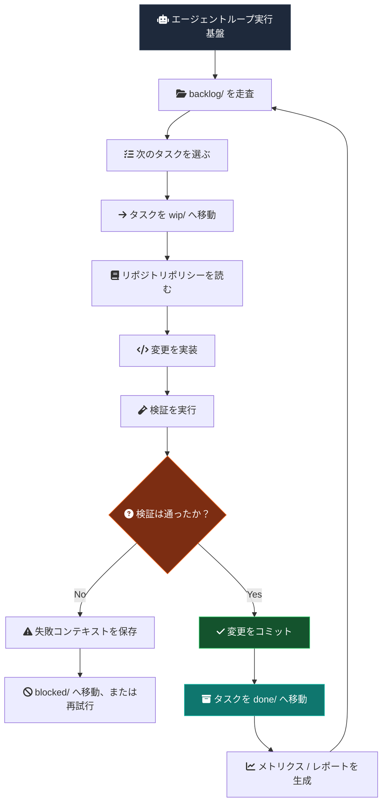
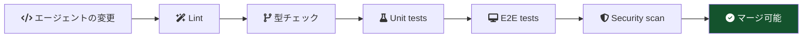
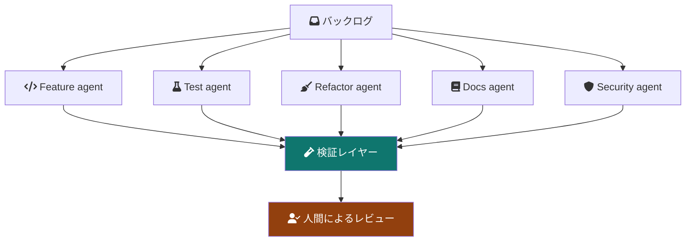
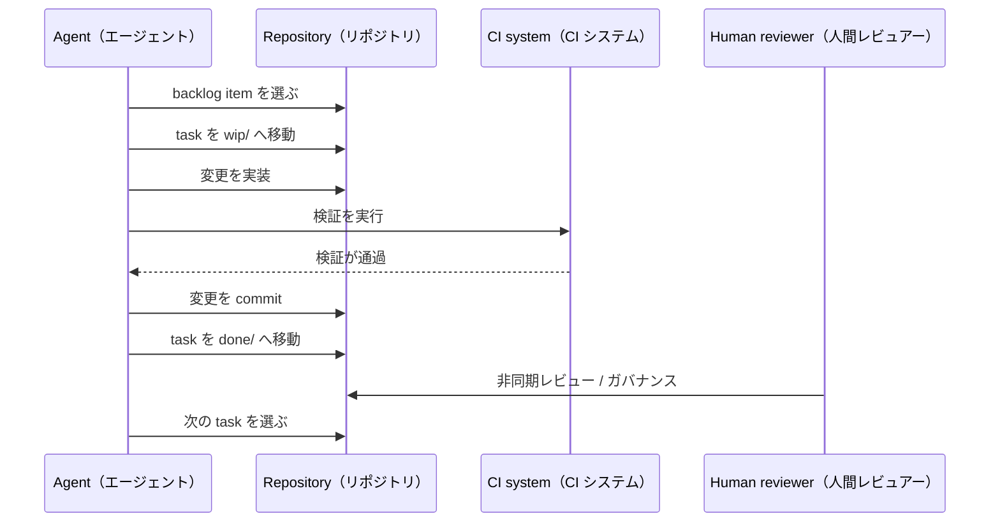

> もしリポジトリ（Repository）自体がスケジューラー（Scheduler）になったら？

現在の AI コーディングワークフローの多くは、まだセッション駆動（session-driven）です。

```txt
Human -> Prompt -> Agent -> Stop
```

これは便利ですが、エージェント（Agent）を一時的なチャット参加者として扱います。リポジトリはそれとは別に、エージェントが永続キュー（persistent queue）から境界づけられた作業（bounded work）を実行し続け、人間がレビュアー・アーキテクト・ガバナーとして残る、継続的に進化するシステムとして設計できます。

運用モデル（operating model）は次に近づきます。

```txt
Human -> Governance -> Continuous Agent Runtime
```

## 基本アーキテクチャ

リポジトリ自体がオーケストレーション層（orchestration layer）になります。

```txt
repo/
├── src/
├── tests/
├── docs/
├── agent/
│   ├── backlog/
│   ├── wip/
│   ├── done/
│   ├── blocked/
│   ├── archive/
│   └── policies/
```

各エンジニアリングタスクはファイルとして存在します。

```txt
agent/backlog/add-search-unit-tests.md
agent/backlog/remove-legacy-api-client.md
agent/backlog/improve-error-boundaries.md
```

これは作業項目（work item）が明示的な状態を移動するという意味でカンバン（Kanban）に近いです。違いは、その状態遷移を git が記録するため、キュー自体がレビュー可能で復旧可能になることです。

## エージェント実行フロー



重要なのは、エージェントが自律的（autonomous）であること自体ではありません。エージェントが、人間が検査できる状態機械（state machine）の中で動くことです。

## なぜファイルシステムカンバンなのか

多くのオーケストレーションシステムは、最終的に git がすでに持つ能力を再発明します。

| 能力 | Git がすでに提供するもの |
| --- | --- |
| Auditability | Commit history |
| Rollback | Git revert |
| Reviewability | Pull requests |
| Ownership | CODEOWNERS |
| Traceability | Commit SHA |
| Replication | Clone/fork |
| Automation | CI/CD |
| State transitions | File movement |

つまりキュー自体が、バージョン管理可能・レビュー可能・再現可能・観測可能・ブランチ可能になります。

## タスク境界

タスクファイルはタイトル以上のものにするべきです。エージェントが操作してよい境界（boundary）を定義します。

```md
# Task

Improve order page loading skeleton.

# Goal

Reduce perceived loading delay and improve CLS stability.

# Constraints

- No layout shift after hydration
- Must support static export
- Avoid client-only rendering

# Validation

bun run test
bun run typecheck
bun run build

# Ownership

frontend-platform

# Priority

P2
```

これによりエージェントには境界づけられた実行面（bounded execution surface）が与えられ、レビュアーには監査しやすい小さな契約（compact contract）が与えられます。

## 実行を止めずに人間が監査できる形

難しい問いは、エージェントが作業を続けられるかどうかではありません。人間が実行時のボトルネック（runtime bottleneck）にならずに、どう関与し続けるかです。

答えは、人間の責任をポリシー・レビュー・例外対応（exception handling）へ寄せることです。


| 役割 | 責任 |
| --- | --- |
| アーキテクト | 境界を定義する |
| レビュアー | 変更を監査する |
| ガバナー | ポリシーを制御する |
| 優先順位づけ担当 | バックログを供給する |
| インシデント対応者 | ブロック状態を扱う |

ループは動き続けますが、ルールの制御は人間に残ります。

## 検証が実行制御になる

エージェントは確率的（probabilistic）です。検証は決定的（deterministic）です。

システムは信頼の置き場を次から移すべきです。

```txt
trusting the agent
```

次へ移します。

```txt
trusting the validation system
```



工学品質が実際に存在するのは、チェック・契約・レビュー可能な差分・ロールバック経路（rollback path）の中です。

## 自己成長する品質

有用な創発的性質（emergent property）の一つは、リポジトリが小さなキュー済みタスクによって少しずつ自分自身を改善できることです。

| 分類 | 例 |
| --- | --- |
| テスト | 不足している edge-case test を追加する |
| リファクタリング | dead abstraction を削除する |
| 型 | type safety を強化する |
| パフォーマンス | bundle size を減らす |
| 信頼性 | retry logic を改善する |
| DX | CI feedback を改善する |
| オブザーバビリティ | 不足している tracing を追加する |
| ドキュメント | docs を同期し続ける |

これは従来型のプロジェクトデリバリーより、複利（compound interest）に近いです。価値は大きな rewrite ではなく、多くの検証済みの小さな改善（micro-improvement）から生まれます。

## 複数エージェントのトポロジー

時間が経つと専門化（specialization）が自然に現れます。



最初のトポロジーは退屈なままでよいです。厳格なキューを持つ単一ワーカーは、群れ（swarm）よりガバナンスしやすい。専門化は、検証・所有権・レビュー容量が強くなってから役に立ちます。

## 失敗モード

このシステムは魔法ではありません。自律性（autonomy）はスループットを増やしますが、間違いも増幅します。

| リスク | 説明 |
| --- | --- |
| 無限ループ | エージェントが同じファイルを繰り返し編集する |
| 検証の攻略 | CI pass だけに最適化される |
| リポジトリのノイズ | commit は増えるが価値が低い |
| コンテキストドリフト | エージェントがアーキテクチャ意図を誤解する |
| コスト爆発 | token と runner usage が無制限になる |
| PR 過負荷 | レビュアーが差分量を吸収できない |
| 偽の生産性 | product value なしに activity だけ増える |

自律性が増えるほど、ガバナンスが重要になります。

## 最小プロトタイプスタック

| レイヤー | 候補 |
| --- | --- |
| キュー | Filesystem Kanban |
| 実行基盤 | Claude Code / Codex / OpenAI Agents |
| 検証 | GitHub Actions |
| 状態 | Git commits |
| ガバナンス | CODEOWNERS and branch rules |
| メトリクス | OpenTelemetry, ELK, Datadog, or Sentry |
| 分離 | Containerized runner |
| スケジューリング | Cron or CI scheduler |

最初のプロトタイプに複雑な制御面（control plane）は不要です。必要なのは小さなキュー、境界づけられたワーカー、決定的なチェック、人間がレビューまたは停止するための明確なルールです。



## Related work

近い方向を示すプロジェクトと論文はいくつかあります。GitHub の [Agentic Workflows](https://github.com/github/gh-aw) はエージェントが実行できる作業定義（work definition）を試しています。GitHub Next の [Discovery Agent](https://githubnext.com/projects/discovery-agent/) は、リポジトリを理解するエージェント（repository-aware agent）がコードベースを調査する形を探索しています。Microsoft Research の [YoloFS](https://www.microsoft.com/en-us/research/publication/dont-let-ai-agents-yolo-your-files-shifting-information-and-control-to-filesystems-for-agent-safety-and-autonomy/) は、ファイルシステム設計がより安全なエージェント自律性のために情報と制御を移せると論じています。

リスクも現在の研究で見え始めています。[Failed agentic pull requests](https://arxiv.org/abs/2601.15195) の研究は、自律的なコーディング試行が実際にどう失敗するかを調べています。[TDFlow](https://arxiv.org/abs/2510.23761) はエージェント的な作業を test-driven feedback loop として捉えます。ワークフローの可視化と WIP 制御の背景としては、公式の [Kanban Guide](https://kanban.university/kanban-guide/) が役に立ちます。[Backlog](https://backlog.so/) も local file を agent-friendly な task orchestration surface として使う近い例です。

## Final thought

最大の unlock は、より賢い model ではないかもしれません。

人間が offline の時でも autonomous engineering work が安全に続けられる repository design かもしれません。

それはソフトウェア工学を、人間が起動する実行（human-triggered execution）から、ポリシーに制約された継続的進化（policy-constrained continuous evolution）へ変えます。
