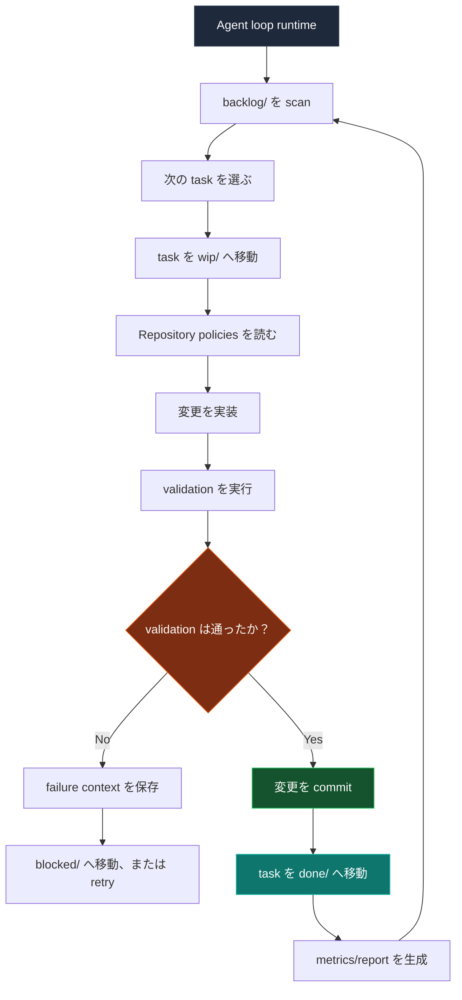
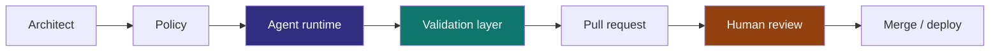
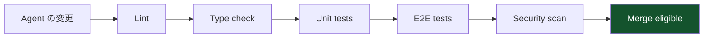
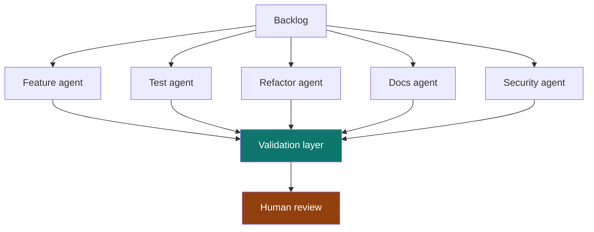
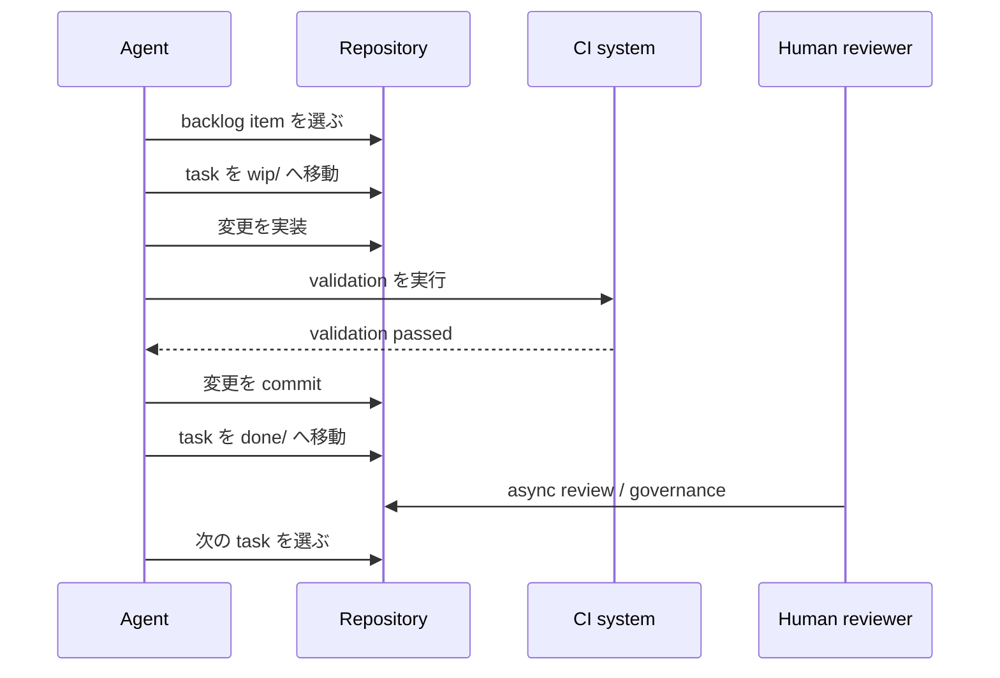

> もし Repository 自体が Scheduler になったら？

現在の AI Coding Workflow の多くは、まだ session-driven です。

```txt
Human -> Prompt -> Agent -> Stop
```

これは便利ですが、Agent を一時的な chat participant として扱います。Repository はそれとは別に、Agent が persistent queue から bounded work を実行し続け、人間が reviewer・architect・governor として残る、継続的に進化する system として設計できます。

Operating model は次に近づきます。

```txt
Human -> Governance -> Continuous Agent Runtime
```

## Core architecture

Repository 自体が orchestration layer になります。

```txt
repo/
├── src/
├── tests/
├── docs/
├── agent/
│   ├── backlog/
│   ├── wip/
│   ├── done/
│   ├── blocked/
│   ├── archive/
│   └── policies/
```

各 engineering task は file として存在します。

```txt
agent/backlog/add-search-unit-tests.md
agent/backlog/remove-legacy-api-client.md
agent/backlog/improve-error-boundaries.md
```

これは work item が明示的な状態を移動するという意味で Kanban に近いです。違いは、その状態遷移を git が記録するため、queue 自体が review 可能で復旧可能になることです。

## Agent runtime flow



重要なのは Agent が autonomous であること自体ではありません。Agent が、人間が inspection できる state machine の中で動くことです。

## なぜ filesystem Kanban なのか

多くの orchestration system は、最終的に git がすでに持つ能力を再発明します。

| Capability | Git がすでに提供するもの |
| --- | --- |
| Auditability | Commit history |
| Rollback | Git revert |
| Reviewability | Pull requests |
| Ownership | CODEOWNERS |
| Traceability | Commit SHA |
| Replication | Clone/fork |
| Automation | CI/CD |
| State transitions | File movement |

つまり queue 自体が versioned・reviewable・reproducible・observable・branchable になります。

## Task boundaries

Task file は title 以上のものにするべきです。Agent が操作してよい boundary を定義します。

```md
# Task

Improve order page loading skeleton.

# Goal

Reduce perceived loading delay and improve CLS stability.

# Constraints

- No layout shift after hydration
- Must support static export
- Avoid client-only rendering

# Validation

bun run test
bun run typecheck
bun run build

# Ownership

frontend-platform

# Priority

P2
```

これにより Agent には bounded execution surface が与えられ、reviewer には監査しやすい compact contract が与えられます。

## Human-auditable without blocking runtime

難しい問いは、Agent が作業を続けられるかどうかではありません。人間が runtime bottleneck にならずに、どう関与し続けるかです。

答えは、人間の responsibility を policy・review・exception handling へ寄せることです。



| Role | Responsibility |
| --- | --- |
| Architect | Boundary を定義する |
| Reviewer | 変更を audit する |
| Governor | Policy を制御する |
| Prioritizer | Backlog を供給する |
| Incident resolver | Blocked state を扱う |

Loop は動き続けますが、rule の control は人間に残ります。

## Validation が runtime controller になる

Agent は probabilistic です。Validation は deterministic です。

System は trust を次から移すべきです。

```txt
trusting the agent
```

次へ移します。

```txt
trusting the validation system
```



Engineering quality が実際に存在するのは、check・contract・reviewable diff・rollback path の中です。

## Self-growing quality

有用な emergent property の一つは、Repository が小さな queued task によって少しずつ自分自身を改善できることです。

| Category | Example |
| --- | --- |
| Testing | 不足している edge-case test を追加する |
| Refactoring | dead abstraction を削除する |
| Types | type safety を強化する |
| Performance | bundle size を減らす |
| Reliability | retry logic を改善する |
| DX | CI feedback を改善する |
| Observability | 不足している tracing を追加する |
| Docs | docs を同期し続ける |

これは traditional project delivery より compound interest に近いです。価値は大きな rewrite ではなく、多くの validated micro-improvement から生まれます。

## Multi-agent topology

時間が経つと specialization が自然に現れます。



最初の topology は退屈なままでよいです。厳格な queue を持つ single worker は swarm より governance しやすい。Specialization は validation・ownership・review capacity が強くなってから役に立ちます。

## Failure modes

この system は魔法ではありません。Autonomy は throughput を増やしますが、mistake も増幅します。

| Risk | Description |
| --- | --- |
| Infinite loops | Agent が同じ file を繰り返し編集する |
| Validation gaming | CI pass だけに最適化される |
| Repo churn | commit は増えるが value が低い |
| Context drift | Agent が architecture intent を誤解する |
| Cost explosion | token と runner usage が無制限になる |
| PR overload | reviewer が diff volume を吸収できない |
| False productivity | product value なしに activity だけ増える |

Autonomy が増えるほど governance が重要になります。

## Minimal prototype stack

| Layer | Suggested choice |
| --- | --- |
| Queue | Filesystem Kanban |
| Runtime | Claude Code / Codex / OpenAI Agents |
| Validation | GitHub Actions |
| State | Git commits |
| Governance | CODEOWNERS and branch rules |
| Metrics | OpenTelemetry, ELK, Datadog, or Sentry |
| Isolation | Containerized runner |
| Scheduling | Cron or CI scheduler |

最初の prototype に複雑な control plane は不要です。必要なのは small queue、bounded worker、deterministic checks、人間が review または stop する rule です。



## Related work

近い方向を示す project と paper はいくつかあります。GitHub の [Agentic Workflows](https://github.com/github/gh-aw) は agent が実行できる work definition を試しています。GitHub Next の [Discovery Agent](https://githubnext.com/projects/discovery-agent/) は repository-aware な agent が codebase を調査する形を探索しています。Microsoft Research の [YoloFS](https://www.microsoft.com/en-us/research/publication/dont-let-ai-agents-yolo-your-files-shifting-information-and-control-to-filesystems-for-agent-safety-and-autonomy/) は、filesystem design がより安全な agent autonomy のために information と control を移せると論じています。

Risk も現在の research で見え始めています。[Failed agentic pull requests](https://arxiv.org/abs/2601.15195) の研究は autonomous coding attempt が実際にどう失敗するかを調べています。[TDFlow](https://arxiv.org/abs/2510.23761) は agentic work を test-driven feedback loop として捉えます。Workflow visualization と WIP control の背景としては official [Kanban Guide](https://kanban.university/kanban-guide/) が役に立ちます。[Backlog](https://backlog.so/) も local file を agent-friendly な task orchestration surface として使う近い例です。

## Final thought

最大の unlock は、より賢い model ではないかもしれません。

人間が offline の時でも autonomous engineering work が安全に続けられる repository design かもしれません。

それは software engineering を human-triggered execution から policy-constrained continuous evolution へ変えます。
