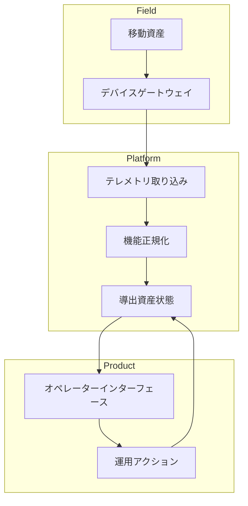

移動資産のクラウドインターフェースは、位置・接続・デバイス状態を静的な事実としてではなく、不安定な入力として扱う必要がある。

## システム境界

## 開発上の考慮事項

この種のインターフェースで最初に犯しがちな間違いは、資産をデータベースの行のように扱うことだ。移動資産には位置があるが、その位置には鮮度の予算がある。デバイス状態があるが、その状態はハートビート・遅延バッチ・最後に既知のメッセージから推定されているかもしれない。ネットワークパスがあるが、そのパスはオペレーターが最も確信を持ちたいときに利用できない場合がある。

これがフロントエンドのモデルを変える。UI はデータの横にデータの鮮度を表示すべきで、ツールチップに隠すべきではない。「不明」「古い」「オフライン」「未設定」を区別すべきで、汎用エラー状態に折りたたむべきではない。これらのラベルはプロダクト設計だが、フロントエンド・バックエンド・テレメトリパイプライン間の技術的契約でもある。

実装では、生のデバイスペイロードをコンポーネントに直接バインドするのではなく、導出ビューモデルを通じて移動資産をモデル化する。生のペイロードはトランスポート固有の詳細を保持でき、ビューモデルは UI に安定したフィールドを提供する：識別情報・最後に観測された位置・最後に観測された時刻・接続状態・カテゴリ・利用可能なアクション。この分離により、レンダリングコードがデバイスプロトコルについて知りすぎることを防ぐ。

| 考慮事項 | 開発上の意味 |
| --- | --- |
| 位置は継続的に変化する | 座標だけでなく、鮮度と信頼度をレンダリングする。 |
| 接続は断続的 | 更新が欠けていることを第一級の状態にする。 |
| デバイスファミリーが異なる | コンポーネント層の前に機能を正規化する。 |
| オペレーターはプレッシャー下でスキャンする | 装飾的な詳細よりステータス階層を優先する。 |

## 持続するパターン

2016年代のウェブスタックでも、プレーンな REST エンドポイント・Rails バックエンドの JSON API・Knockout ビューモデル・Angular コンポーネント・ポーリングと WebSocket の組み合わせで実装できる。ツールの選択よりも契約の方が重要だ：すべての移動資産 UI には不確実性のための語彙が必要だ。その語彙が存在すれば、システムはユーザーに何を知っているか・何を知らないか・何がまだ安全に実行できるかを示すことができる。
