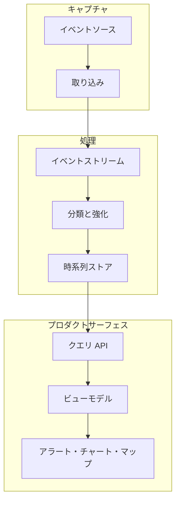

インターフェースが何が起きたか・いつ起きたか・システムがそれを説明できるかどうかに依存するとき、イベントパイプラインはユーザー体験の一部になる。

## パイプラインの形状

## 開発上の考慮事項

イベントデータがユーザー体験になるのは、インターフェースがイベントの順序・鮮度・解釈に依存するときだ。チャート・アラートリスト・マップマーカーは単にデータをレンダリングしているわけではない。何かが起きたこと、そしてシステムがそれを表示するのに十分理解していることを主張している。

開発上の課題は通常、生のイベントの忠実度とプロダクトの有用性の間にある。生のイベントストリームはデバッグと分析に重要な詳細を保持するが、ユーザーインターフェースには安定したセマンティクスが必要だ：イベントタイプ・観測時刻・影響を受けた資産・重要度・信頼性・そしてイベントが実行可能かどうか。そのマッピングは、散在したコンポーネントロジックとしてではなく、意図的に行われるべきだ。

フロントエンドが API を通じて時系列やイベントデータを直接クエリするとき、クエリの契約が重要になる。ページネーション・時間範囲・重複除去・タイムゾーン処理・null フィールドがすべてユーザーの信頼を形成する。UI が不正なイベントを黙って落とすと、ユーザーは欠如を見る。すべての生のエッジケースを表示すると、ユーザーはノイズを見る。プロダクトにはイベントデータを理解可能な状態に変える中間層が必要だ。

| パイプライン層 | UX の責任 |
| --- | --- |
| 取り込み | 欠損または遅延イベントをデバッグするのに十分なソース詳細を保持する。 |
| ストリーム処理 | 一貫したイベントの意味と重要度を付与する。 |
| ストレージ/クエリ | 時間ウィンドウとフィルターを予測可能にする。 |
| UI レンダリング | 鮮度・空の状態・実行可能性を説明する。 |

## 持続するパターン

2018年までに、運用プロダクトがストリーム処理・Kafka スタイルのイベントトランスポート・Druid や Elasticsearch スタイルの分析クエリ・Chart.js・D3・カスタムマップビューで構築されたダッシュボード層を組み合わせることが一般的になっていた。再利用可能なポイントは、イベントパイプラインはバックエンドだけのインフラストラクチャではないということだ。フロントエンドが運用実態について信頼性の高い発言ができるかどうかを決定する。
