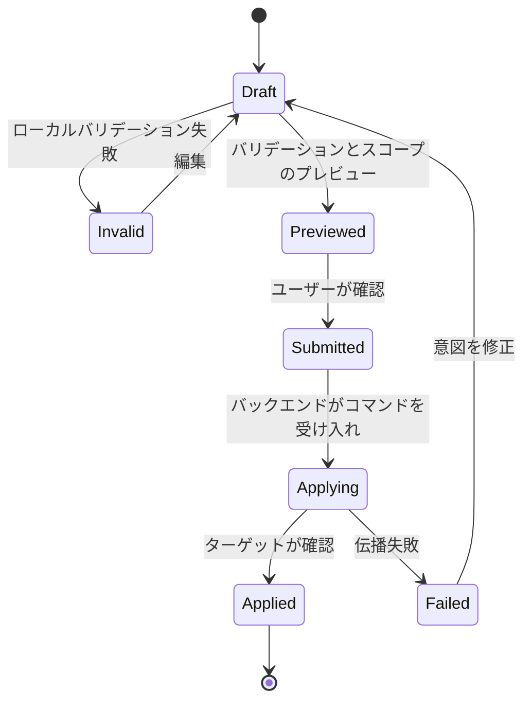

分散システムの設定インターフェースは、変更を簡単にする前に変更を理解可能にする必要がある。

## 設定ライフサイクル

## 開発上の考慮事項

設定 UI はリスクが高い。なぜなら人間の意図を分散した動作に変えるからだ。ボタン一つでデバイスのレポート方法・アラートの発火方法・オペレーションメッセージの受信者を変更できる。インターフェースはそれを単純なフォーム送信として扱うことはできない。

主な開発上の考慮事項はスコープを可視化することだ。変更を適用する前に、ユーザーはどのオブジェクトが影響を受けるか・どのルールが変更されるか・必須フィールドが揃っているか・システムが次に何をするかを知る必要がある。UI はフォームの形状ではなく変更の結果に基づいたバリデーション・プレビュー・確認を提供すべきだ。

実装では、通常ドラフトモデルが有用だ。UI はローカルドラフトを編集し、型付きコントラクトに対してバリデーションし、影響を受けるターゲットをプレビューし、その後にのみコマンドを送信する。送信後、バックエンドが伝播を確認するか少なくともジョブを受け入れるまで、UI はすぐに成功を示唆すべきではない。分散システムでは「保存」と「適用」は異なる状態だ。

| UI 状態 | 意味 |
| --- | --- |
| Draft | ユーザーはシステムに影響を与えていない意図を編集中。 |
| Validated | システムは要求された変更を理解できる。 |
| Submitted | 変更要求が処理のために受け入れられた。 |
| Applied | 影響を受けたターゲットが変更を観測または確認した。 |
| Failed | システムが変更がどこで停止したかを説明できる。 |

## 持続するパターン

スタックが Rails・Node.js・Java サービス・API の背後にメッセージキューを使用しているかどうかにかかわらず、有用な実装パターンは同じだ：編集と適用を分離する。設定 UI はドラフト・バリデーション・送信・伝播・観測を異なるプロダクト状態としてモデル化すべきだ。なぜならユーザーはそれらの状態を異なる方法で体験するからだ。
