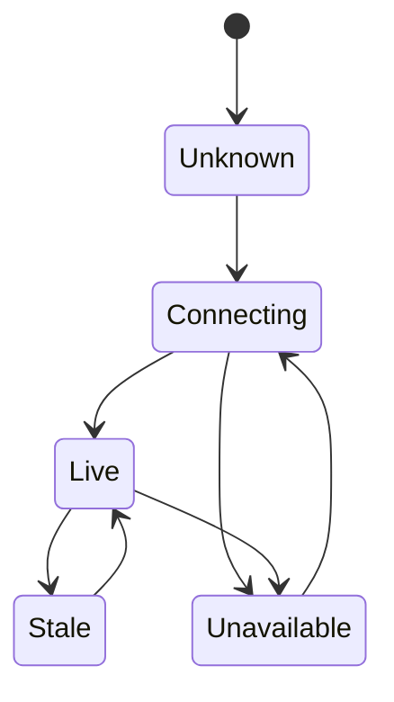

ハードウェアに近いフロントエンド作業は、ブラウザがそれをコントロールしているふりをすることなく現実を表現しなければならない。

## 境界の前提

| フロントエンドの前提 | ハードウェアとネットワークの現実 |
| --- | --- |
| データはリクエスト順に届く。 | デバイスデータは遅延・欠損・再送される場合がある。 |
| エラーはアプリケーション状態だ。 | エラーはカバレッジの空白・電力・物理的条件から来ることがある。 |
| リフレッシュは無害だ。 | リフレッシュはステートマシンやストリームセットアップの問題を隠す可能性がある。 |
| UI 状態はローカルだ。 | UI 状態はしばしば収束途中のリモートシステムを反映する。 |

## 開発上の考慮事項

ハードウェアに隣接するフロントエンド作業は、ブラウザがコントロールできないシステムを表現することを強いる。UI はストリームをリクエストし・マップマーカーを描画し・設定を送信できるが、電波カバレッジ・デバイスの電力・センサーの状態・クロックの精度を保証することはできない。

これによってコンポーネントの設計方法が変わる。楽観的な前提の代わりに、UI には明示的な不確実性が必要だ。マップマーカーには最後に既知の時刻を持てる。カメラタイルはストリームセットアップとメディアの可用性を分離できる。センサー読み取りは鮮度・古さ・予想範囲外かどうかを示せる。これらは装飾的なラベルではない。プロダクトが真実を伝える方法だ。

開発アーキテクチャは多くのコンポーネントにハードウェア条件を広げることを避けるべきだ。より良い形状は、生のデバイスとネットワークシグナルを小さな UI 状態のセットに正規化することだ。コンポーネントはその状態を一貫してレンダリングし、テストは外部システム全体を再現することなく状態マトリックスをカバーできる。

## 状態モデルのスケッチ

## 持続するパターン

エンジニアリングの姿勢はシンプルだ：ハードウェアに近いフロントエンドコードは謙虚で・明示的で・観測可能であるべきだ。UI が Angular・React・Knockout・プレーン JavaScript で書かれているかどうかにかかわらず、ブラウザはデバイス・ネットワーク・ストリームパイプラインが提供できるよりも強い保証を持っているふりをすべきではない。
