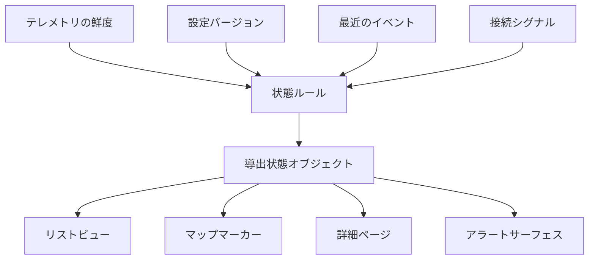

デバイス状態は、人々がそれを使って何を信頼し・検査し・次に変更するかを決定するときにプロダクトサーフェスになる。

## 状態の導出

## 開発上の考慮事項

デバイス状態は解釈層だ。バックエンドはデバイスについて多くの事実を知っているかもしれない：最後のメッセージ時刻・ファームウェアバージョン・接続結果・設定バージョン・位置・最近のイベント。ユーザーはより小さな答えが必要だ：このデバイスは正常か・注意が必要か・次に何ができるか？

プロダクトサーフェスはこれら2つの世界の間にある。重要な場所では技術的なニュアンスを保持すべきだが、すべてのオペレーターが生のテレメトリを検査することを強いるべきではない。これは通常、明確なルールで導出状態を構築し、ユーザーが結果を信頼するのに十分なほどルールを可視化することを意味する。

フロントエンド開発では、重要な成果物は状態コントラクトだ。コンポーネントはラベル・重要度・鮮度・説明・利用可能なアクションを含む状態オブジェクトを受け取るべきだ。このコントラクトにより、リスト・詳細ページ・マップ・アラートを一貫してレンダリングしやすくなる。

| 状態フィールド | なぜ重要か |
| --- | --- |
| ラベル | ユーザーにスキャンしやすい状態を与える。 |
| 重要度 | 注意の優先順位付けを助ける。 |
| 鮮度 | 古いデータが現在のものに見えることを防ぐ。 |
| 説明 | 導出状態を監査可能にする。 |
| 利用可能なアクション | 状態を運用上の次のステップに接続する。 |

## 持続するパターン

状態はプロダクト API であり、単なるデータベースのプロジェクションではない。時系列ストア・キャッシュ・検索インデックス・ストリームプロセッサーがすべて状態に情報を提供できるが、ユーザー向けの契約は安定したままであるべきだ：何が起きているか・シグナルはどれだけ新鮮か・システムはなぜそう考えるか・次に何ができるか。
