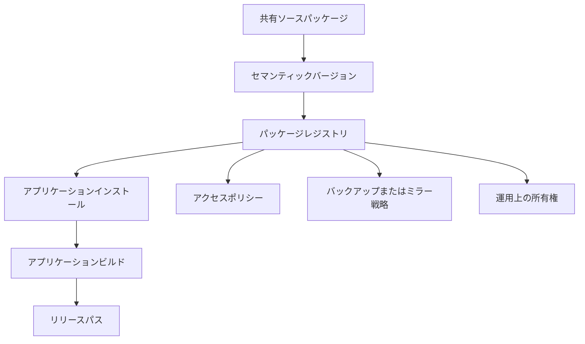

プライベートパッケージレジストリは開発者の利便性として始まり、プロダクトのビルドがそれなしに動かなくなるときインフラストラクチャになる。

## 依存関係のトポロジー

## 開発上の考慮事項

プライベートパッケージレジストリはしばしば効率化ツールとして始まる。チームは認証ヘルパー・UI ユーティリティ・チャートラッパー・環境グルーを共有パッケージに抽出し、アプリケーションが速く動けるようにする。本番ビルドがそのレジストリに依存する瞬間、それはインフラストラクチャになる。

このシフトはエンジニアリング要件を変える。アクセスはドキュメント化される必要がある。所有権は明確である必要がある。ビルドはマシン・ネットワーク・デプロイ環境が変わっても再現可能である必要がある。パッケージの公開にはバージョニングの規律が必要で、あるチームが偶然に別のチームを壊さないようにする。

フロントエンドの懸念はインストールだけではない。共有パッケージはアプリケーションアーキテクチャを形成する。パッケージが多すぎるプロダクト動作を所有すると、すべての利用アプリが隠れた結合を継承する。少なすぎると、実際のレバレッジなしにリリースのオーバーヘッドを追加する薄いラッパーになる。有用な境界は通常、小さな API と明確な互換性の期待を持つ安定したユーティリティまたはプリミティブだ。

## インフラストラクチャとしてのレジストリ

| インフラストラクチャの懸念 | パッケージレジストリの同等物 |
| --- | --- |
| 可用性 | アプリケーションはビルドが必要なときに依存関係をインストールできるか？ |
| アクセス制御 | 適切な人とシステムがパッケージを読み取りまたは公開できるか？ |
| 障害復旧 | レジストリが利用できない場合にパッケージを復元またはミラーできるか？ |
| オブザーバビリティ | チームは公開・インストール・バージョンの問題を素早く特定できるか？ |

## 持続するパターン

npm・Yarn・Verdaccio・Artifactory・Nexus・クラウドホスティングのレジストリはすべてパッケージ共有をルーティンに感じさせるが、運用モデルはまだ重要だ。開発者の利便性はリリースがそれに依存するときプロダクトインフラストラクチャになる。
