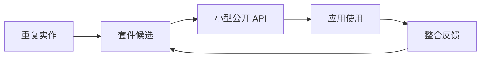
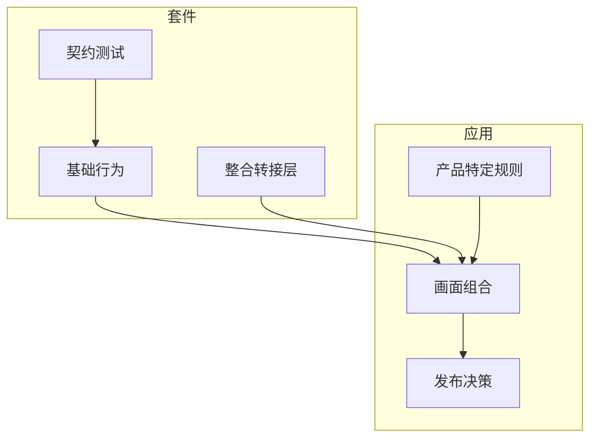

内部 package 的杠杆，来自移除重复工作，而不是让每个应用都依赖一个隐藏流程。

## 摘记问题

什么是最小的 shared package system，能让前端团队取得杠杆，又不会让每个应用都变成 dependency-management project？

这是一个摘记问题，因为答案不只是「抽出 common code」。有趣的部分是边界：哪些决定应该成为 shared primitive，哪些决定应该留在产品应用里，以及哪些 feedback signal 能证明 package 真的有帮助，而不是增加仪式。

## 实验设计

这个摘记从重复工作开始，而不是从架构开始。好的 candidate 很容易辨识：在不同 app 间复制的 authentication wrapper、dashboard 里重复的 chart normalization、每个 deployment target 都重写的 environment helper，或因为上一版太靠近某个产品而被重新做的 test utility。

以 2019 年的 frontend stack 来看，package 机制可以是 npm 或 Yarn，registry 可以是 Verdaccio、Nexus、Artifactory 或 hosted package service。Registry 只是 distribution mechanism。真正的设计工作，是判断 package 是否有稳定 API、可测试的 behavior surface，以及 consumer 能理解的 versioning story。

## 边界草图

Package 应该拥有无聊、可重复的行为：formatting、validation、request conventions、chart setup、logging shape 或 browser compatibility helpers。Application 应该拥有产品决定：workflow order、permission meaning、copy、screen composition 与 release timing。

这个切分让 shared code 有用但不神秘。Consumer 可以升级 package，因为 API 小、changelog 可读、semantic version 说清楚接受的是哪一种风险。Package author 可以改善 internals，因为 contract 被测试保护。

## 这个摘记想证明什么

目标不是最大化 shared code。目标是减少重复决定。

如果 package 有效，一个新的 application 应该需要更少 setup 就能达到一致 baseline。Chart 应该在不需要每个团队记得同一批 options 的情况下，看起来与行为都一致。Request helper 应该用可辨识的方式失败。Test utility 应该让预期行为更容易被表达。

这个摘记的有用输出，是一条 rule of thumb：

> 只有当团队能命名行为、测试 contract，并说明 consumer 如何从坏版本恢复时，才抽出那个决定。

这比「我们复制了两次」更严格。它把 internal package 视为给其他工程师使用的产品界面，而不只是放 shared files 的地方。
