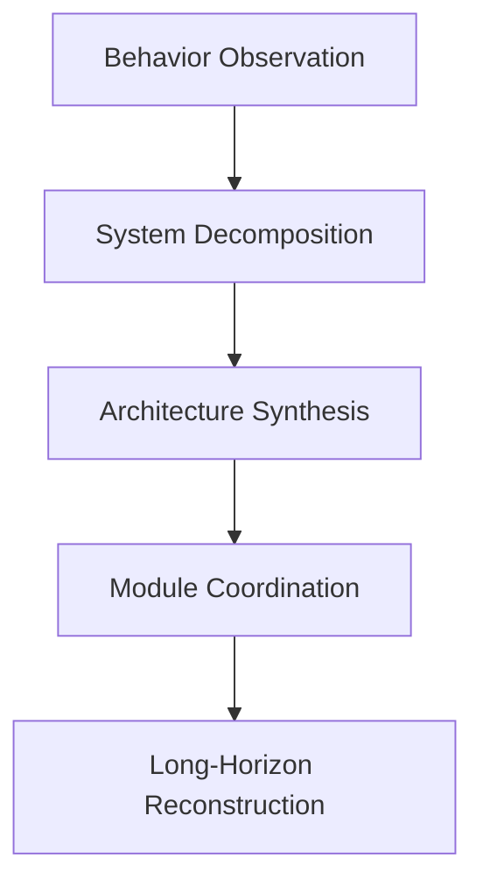
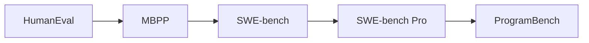
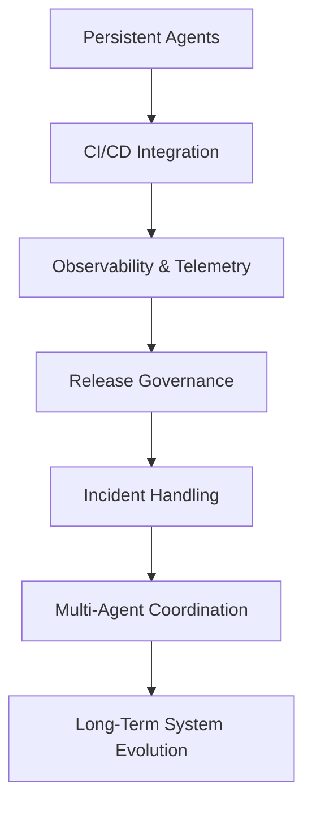

_为什么「会写 code」已经不是真正的问题_

过去几年，AI coding 的讨论几乎都围绕着一个核心叙事：

> 模型越来越会写 code。

从：

- HumanEval
- MBPP
- SWE-bench

到后来的 SWE-bench Pro，

大部分 benchmark 的核心都还是在测：

```text
AI 能不能更有效率地完成程序代码生成？
```

但在读完 Meta FAIR 最近提出的 **ProgramBench** 后，我认为整个方向其实已经开始转变。

因为 ProgramBench 不再只是问：

```text
AI 会不会写 code？
```

而是开始问：

```text
AI 能不能重建与设计完整软件系统？
```

而这两者之间，其实隔着非常巨大的距离。

## 从 Code Generation 到 System Reconstruction

与 SWE-bench 不同，ProgramBench 几乎把既有 repo 的支撑全部移除。

它给模型的只有：

- executable binary
- CLI behavior
- README / docs

但：

- 不提供 source code
- 不提供 internet
- 不提供 decompiler

然后要求 agent：

```text
从零重建整个软件系统
```

包括：

- architecture
- module design
- abstractions
- interfaces
- runtime behavior
- build systems
- edge-case handling

而且最重要的是：

> 它的验证方式是 behavioral equivalence，而不是 implementation equivalence。

也就是说：

只要最终行为一致，即使内部架构完全不同也可以通过。

这让它与传统 coding benchmark 有本质上的差异。

## 为什么 ProgramBench 很不一样？

目前大部分 coding benchmark，本质上都还是在测：


但 ProgramBench 开始测的是：



也就是：

```text
从「写 code」
转向「构建系统」
```

而我认为这个转变，其实比目前大部分 benchmark 讨论还更重要。

## 最值得注意的结果：模型是怎么失败的

这篇 paper 最有趣的地方，其实不是模型分数低。

而是：

```text
模型是如何失败的
```

paper 里反复观察到：

frontier models 非常容易产生：

- monolithic implementation
- oversized single-file design
- weak abstraction
- poor modular decomposition
- limited architectural layering

这其实是目前 AI coding 最关键的限制之一。

因为它揭露了一件很重要的事：

> 现在的 frontier AI 非常擅长修改既有 architecture，
> 但非常不擅长发明 robust architecture。

## Repository Parasite 现象

我自己目前对现代 coding agents 有一个观察：

只要：

- repo 已存在
- conventions 已存在
- tests 已存在
- CI 已存在
- ownership boundaries 已存在

AI 就会变得非常强。

它们非常擅长：

- patching
- extending
- refactoring
- optimizing

但一旦：

```text
architecture 本身消失
```

能力会快速下降。

这代表目前 frontier AI 更像：

```text
超级强大的 maintenance engineer
```

而不是：

```text
真正的 system architect
```

而这其实跟很多工程师现在实际感受到的现象非常一致。

## 为什么 AI 会偏向 monolithic？

我认为这并不是偶然。

LLM 的本质是：

```text
token-sequence continuation system
```

它天然擅长：

- 线性延伸
- 区域一致性
- nearby optimization

但 architecture 刚好相反。

好的 architecture 需要：

- future extensibility
- delayed planning
- separation of concerns
- abstraction boundaries
- interface discipline
- non-local reasoning

而这些恰好是 autoregressive systems 最困难的地方。

所以很多 AI generated systems 都会有一种感觉：

```text
能跑，但架构不像人类 architect 设计出来的系统
```

code 可能可以执行。

tests 可能会通过。

但系统结构常缺乏：

- intentional decomposition
- long-term maintainability
- clear abstraction layering

## Benchmark 的演化方向

ProgramBench 其实也反映了整个 benchmark landscape 的演化。

大概长这样：



每个 benchmark 都在逐步往更高 abstraction 前进：

| Benchmark     | 核心能力                                |
| ------------- | ----------------------------------- |
| HumanEval     | Function generation                 |
| MBPP          | Small program synthesis             |
| SWE-bench     | Repository issue fixing             |
| SWE-bench Pro | Long-horizon repository engineering |
| ProgramBench  | Architecture synthesis              |

而这其实很符合真实世界工程工作的演化。

真正困难的工程问题，通常不是：

- syntax
- algorithm
- local implementation

而是：

- system design
- coordination
- lifecycle management
- complexity control

## Software Engineering 并不等于 Coding

我认为这其实是 ProgramBench 最重要的哲学含义。

真正的 software engineering，从来都不是单纯生产 code。

而是：

- complexity management
- constraints handling
- maintainability
- long-term evolution

一个软件系统真正存在于：

- organizations
- deployment pipelines
- release governance
- observability systems
- operational economics
- ownership structures

传统 benchmark 几乎测不到这些东西。

而 ProgramBench 开始透过：

- ambiguity
- reconstruction
- long-horizon reasoning
- architecture formation

逐步碰到这个层面。

## ProgramBench 仍然还没测到的东西

即使 ProgramBench 已经非常强，但它仍然缺少很多真正软件工程的重要部分。

### 1. Organizational Constraints

现实世界里还有：

- product negotiation
- release pressure
- rollback planning
- governance
- security reviews
- operational risk

benchmark 目前仍几乎没有测到。

### 2. Long-Term Maintainability

tests pass today，不代表半年后还 maintainable。

真正 architecture quality 的关键在于：

- extensibility
- operational simplicity
- future iteration cost
- failure isolation

而这非常难 benchmark。

### 3. Human Coordination

大型 software engineering 本质上是 collaborative system。

很多 architecture decisions 并不是：「理论最优」。

而是因为它们：

- 降低 coordination cost
- 提升 team scalability
- clarify ownership

目前 benchmark 仍主要在测 isolated agents，而不是 socio-technical systems。

## 下一代 Benchmark 可能会长什么样子？

我认为 ProgramBench 只是开始。

未来 benchmark 很可能会开始测：



也就是：

benchmark 本身，开始逐渐变成：

```text
software platform problem
```

而不再只是：「model 能不能写 code」。

## 最后的想法

ProgramBench 真正揭露的是：

> AI 已经逐渐接近「修改软件」，
> 但离「设计软件工程系统」仍然有非常大的距离。

而这个距离非常重要。

因为真正高杠杆的工程工作，从来都不是：

- 写 syntax
- 生成 boilerplate
- 补 implementation

而是：

- shaping systems
- controlling complexity
- enabling future evolution
- coordinating humans and machines over time

而我认为，ProgramBench 很可能会成为第一批真正揭露这条边界的重要 benchmark 之一。

## References

1. ProgramBench: *Can Language Models Rebuild Programs From Scratch?*  
   [https://arxiv.org/abs/2605.03546](https://arxiv.org/abs/2605.03546)

2. ProgramBench PDF  
   [https://arxiv.org/pdf/2605.03546](https://arxiv.org/pdf/2605.03546)

3. SWE-bench Official Site  
   [https://www.swebench.com/](https://www.swebench.com/)

4. SWE-bench Pro Paper  
   [https://arxiv.org/abs/2509.16941](https://arxiv.org/abs/2509.16941)
