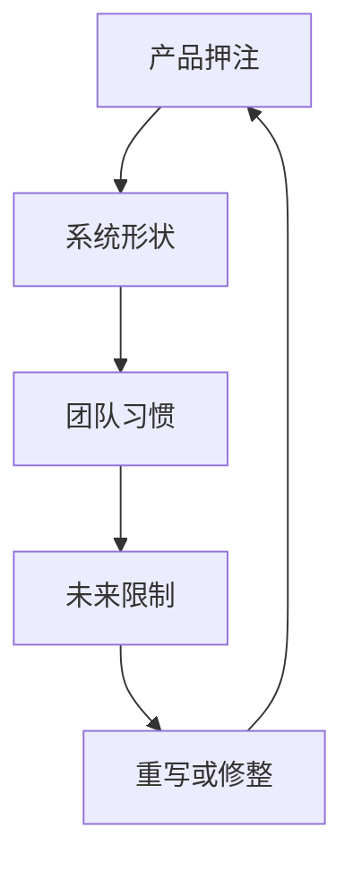

长期产品透过积累来教人：每个架构选择、团队变化与市场押注，都会留下痕迹。

## 产品会记得

长期产品奇妙的地方，是即使团队忘了某些决定，产品仍然记得。Route boundary、status name、chart abstraction、retry behavior 或 package convention，可能穿过好几轮人员与计划变动。程序代码继续带着旧假设。

这不一定坏。有些旧假设是产品智慧。有些是变成架构的捷径。困难的是，在重写一切之前先分辨它们。

## 命名会承重

第一个教训是：命名比想象中重要。如果产品无法命名 device state、event type、configuration scope 或 ownership boundary，程序代码就会替同一件事发明好几个名字。那些名字会渗进 API、dashboard、test、incident language 与 onboarding conversation。

这也是前端与平台工作安静交会的地方。界面上的 label 可能变成 support 使用的语汇。Status enum 可能变成 API contract。Chart grouping 可能变成管理者理解系统的方式。命名不是架构之后的 polish；它是架构的一部分。

## 平台不是一个地方

第二个教训是：平台工作不只存在于 infrastructure。Frontend component library、status model、package convention、deployment check 或 debugging playbook，只要其他团队建立在它上面，就可能成为平台工作。

2019 年前后，这常代表同时与多代前端架构共存：较早的 Knockout 或 AngularJS pattern、Angular 或 React component、Rails 或 Node.js API、npm package、CI script，以及由 Chart.js 或 D3 这类公开 library 做出的 dashboard。技术清单不是重点；重点是效果：一旦另一个团队依赖某个 surface，那个 surface 就有平台责任。

## 不戏剧化地改变

第三个教训是：rewrite 不是唯一的技术改变形式。产品可以透过 compatibility layer、extracted utility、更好的 route boundary、更清楚的 state model、更严格的 validation，以及更可观测的 release path 来演化。这些变化没有 rewrite 戏剧化，但常能在降低风险的同时保留交付。

长期产品会惩罚只为下一次 release 最优化的设计。它也会惩罚把每个旧决定都视为错误的团队。比较好的姿态是问：产品学到了什么？其中哪些学习值得被整理成更干净的界面？

Framework 会变。比较难的问题会留下来：产品暴露什么状态、哪些 contract 要稳定、shared code 应该住在哪里，以及团队如何知道系统仍然在说实话？
