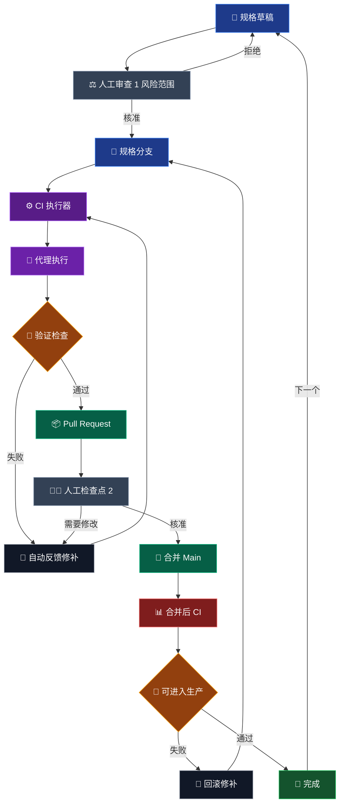

这是一个规格优先的交付迴圈，用来在使用代理时保留工程判断。

重点不是代理能多快写出程序代码。重点是工作会通过明确的检查点，让风险、验证与所有权持续可见。

## 运作迴圈

## 为什么第一个审查重要

第一个人工检查点不是程序代码审查，而是风险范围审查。

在代理开始之前，规格应该让影响范围清楚可见：哪些地方可以改、哪些地方不能改，以及哪些检查能证明工作可以接受。这个阶段退回很便宜，因为实作还没有开始产生。

## 代理应该放在哪里

代理执行应该站在 CI 后面，而不是取代 CI。

代理可以修补、重跑，并回应验证反馈，但这个迴圈要被测试、类型检查、构建输出与可审查的 diff 约束住。这样速度才会绑在证据上，而不是绑在信心上。

## 为什么需要第二个检查点

Pull Request 检查点让人判断结果是否可维护，而不只是是否通过。

如果变更需要调整，就回到反馈修补迴圈。如果通过审查，就合并到 `main`，再用合并后验证作为独立的生产准备门槛。

## 完成只是暂时状态

这个迴圈最后会回到下一份规格草稿。

这很重要，因为代理工程不是一次性的生成事件。它是一种让交付持续前进的方法，同时保留审查、回滚与生产检查，让软件维持可靠。
