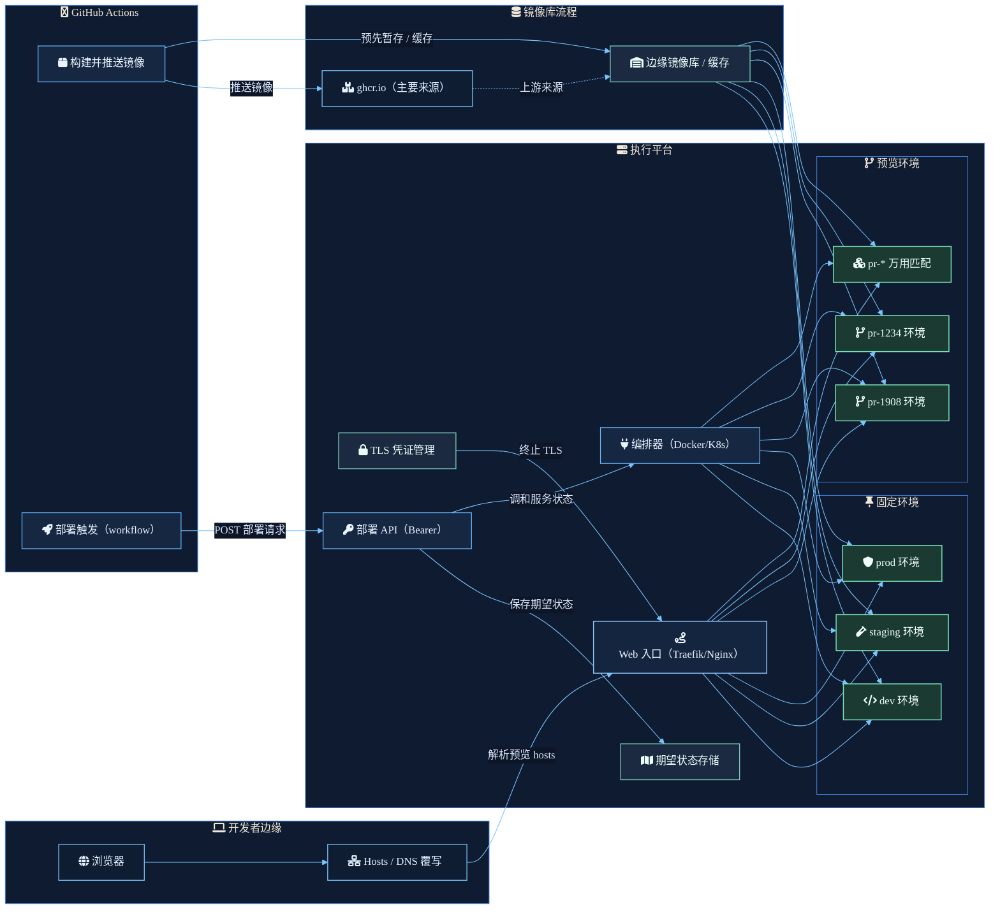

预览环境要容易操作，工作流就需要拆成清楚的责任。

浏览器不需要知道目标是长期存在的 dev 环境，还是短生命周期的 pull request 环境。GitHub Actions 不需要知道 ingress 规则如何套用。runtime 也不应该从目前正在跑的容器反推部署意图。每个部分都应该只负责一件明确的事。

## 请求路径

开发者边缘从本机解析开始。浏览器请求会经过 hosts 文件或 DNS override，接着进入平台 ingress。这让预览 hostname 变成明确入口，而不是把本机机器和容器位置绑在一起。

## 成品路径

GitHub Actions 构建镜像，并把镜像推到作为主要来源的 `ghcr.io`。边缘 registry 或 cache 则把镜像先放到更靠近 runtime 平台的位置，让固定环境和动态环境都从同一条本地成品路径取得镜像。

## 控制路径

部署 workflow 会调用以 bearer token 保护的 deploy API。这个 API 先记录期望状态，再要求 orchestrator reconcile services。关键边界在于：部署意图要和 runtime side effect 分开保存。

## Runtime 路径

Orchestrator 会 reconcile 固定环境候选，例如 `dev`、`staging` 和 `prod`，也会 reconcile 动态预览环境，例如 `pr-1908` 或 `pr-1234`。TLS 在 ingress 层终止，gateway 则把流量导向目前符合请求 hostname 的环境。

结果是一套预览系统：URL、镜像、期望状态与 service reconciliation 都能分开调试，但仍然由同一条部署流程串起来。
