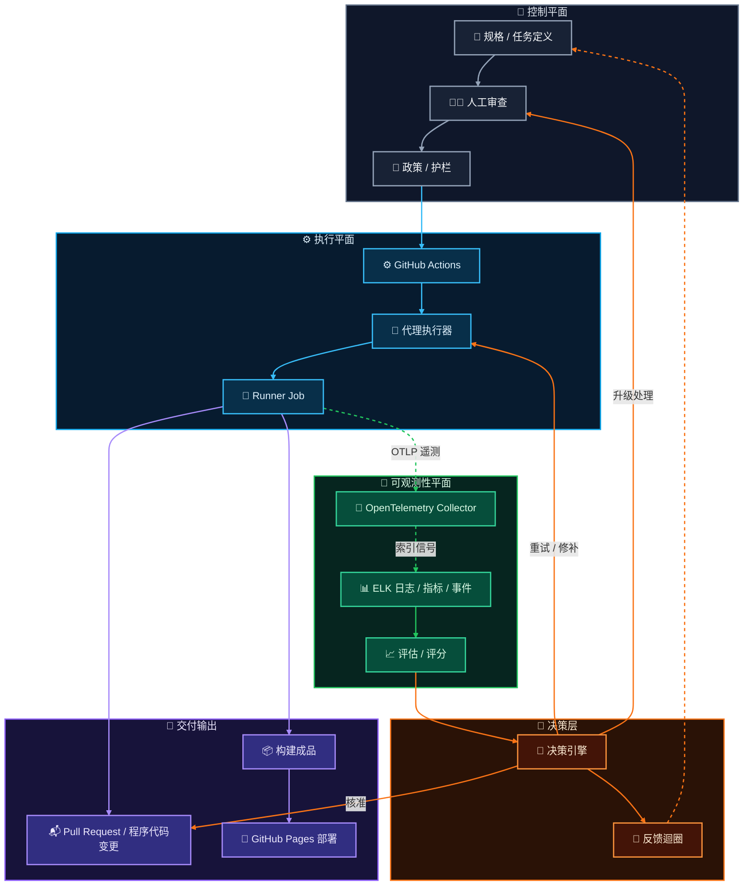

这个模型不只是 `CI -> deploy`，也不只是 `agent -> pull request`。

它把治理拆成几个平面。控制平面定义意图与护栏。执行平面产生程序代码与成品。可观测性平面记录发生了什么事。决策层把遥测与审查信号转成核准、重试、升级处理，或反馈。

## 执行通道

执行通道维持确定性：

`规格 -> 人工审查 -> 政策 -> GitHub Actions -> 代理执行器 -> Runner Job -> 构建成品 -> GitHub Pages 部署`

这条路径负责状态变更。它判断一个已审查的任务是否可以执行、runner 是否产生了程序代码变更或成品，以及静态网站成品是否能送到 GitHub Pages。

## 可观测性通道

可观测性通道是旁路：

`Runner Job -> OpenTelemetry Collector -> ELK -> 评估 / 评分`

Job 会把日志、指标、trace 与事件作为 OTLP 遥测送出。Collector 会将信号标准化，再转送到 ELK，用于索引、搜索、仪表板与调查。接着评估流程会把这份记录转成执行分数、异常信号，以及 pipeline 排名输入。

## 决策迴圈

决策层消化评估输出，但不让可观测性变成部署依赖。

它可以核准 pull request、要求代理重试并修补、升级回人工审查者，或把学到的经验反馈到下一个任务定义。这让迴圈对代理工作有用：判断保持明确，重试保持有界，系统也会积累证据，知道哪些 job 与 pipeline 值得信任。

## 治理规则

部署不应该依赖日志是否成功写入。

如果遥测捕获延迟，或 ELK 无法使用，构建路径仍然应该能根据自己的检查完成或失败。可观测性的用途是解释发生了什么事、比较执行结果、检测异常，并在事后对 pipeline 评分或排序。

这种分离让 GitHub Actions 负责交付，而 OpenTelemetry 与 ELK 成为诊断记录。结果是一套 CI 系统：执行保持确定性，诊断则足够丰富，可以支持 job 层级的可追踪性、异常检测、评估与 pipeline 治理。
