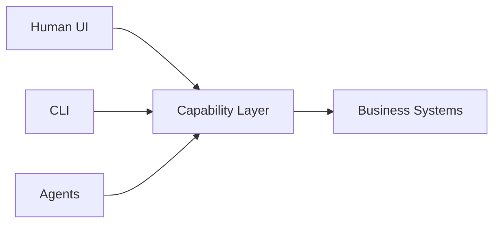

最近看到 [Microsoft Research 的 WebWright 文章](https://www.microsoft.com/en-us/research/articles/webwright-a-terminal-is-all-you-need-for-web-agents/)，我觉得它不只是另一个 browser automation demo。

它其实在重新定义一个问题：

> Browser Agent 真的需要 Browser UI 吗？

## 当前 Browser Agent 的问题

大部分 Web Agent 的流程都是：

```text
LLM
 ↓
Playwright / Puppeteer
 ↓
Browser UI
 ↓
DOM / Screenshot / OCR
```

这种模式会产生很多问题：

* screenshot token 成本很高
* DOM 非常 noisy
* automation 不稳定
* state 难管理
* context window 爆炸
* 执行速度慢

实际上很多时候：

Agent 根本不需要“看懂页面”。

真正需要的是：

> 可操作的结构化 state

## WebWright 的核心思想

WebWright 把 Browser Interaction 抽象成：

```text
Terminal Interface
```

而不是 GUI Browser。

也就是说：

* 不依赖 screenshot
* 不依赖鼠标推理
* 不依赖视觉理解

而是：

```text
Agent ↔ Structured Web Environment
```

它更像：

```text
Web Runtime
```

而不是 Browser Automation。

## 它真正解决的问题

### 1. 降低 Token 成本

Visual reasoning 非常昂贵。

尤其 enterprise system：

* CMS
* ERP
* CRM
* dashboard
* internal tools

很多 workflow 本质上都是：

* repetitive
* state-driven

Agent 真正需要的是：

* action
* state
* workflow transition

而不是 pixel。

### 2. 降低 Ambiguity

现代 Web UI：

```text
对人类友好
```

但：

```text
对 Agent 不友好
```

Terminal-style interaction 更偏向：

* deterministic
* semantic
* structured

这种 execution model。

### 3. 提升 Determinism

GUI automation 最大的问题之一就是 flaky。

例如：

* animation timing
* overlay
* lazy render
* responsive layout

WebWright 实际上是在建立：

```text
Semantic Interaction Layer
```

而不是 pixel interaction。

## 更大的变化

重点不是：

> “terminal 控制 browser”

真正重要的是：

> Web 正在被重新抽象

过去：

```text
Human-first Web
```

未来：

```text
Agent-first Web
```

## 未来可能的架构



UI 不再是唯一入口。

Agent 会直接操作：

* workflow
* forms
* capabilities
* state machines
* automation pipelines

## 对 Frontend Architecture 的影响

未来很多系统会开始需要：

```text
UI Layer
Capability Layer
Agent Layer
Automation Layer
```

最终：

> UI 只是 capability 的一种 renderer。

## 总结

WebWright 不一定是最终答案。

但它代表了一个非常重要的方向：

> Browser 不再只是给人类使用。

而会逐渐变成：

```text
Agent Runtime
```

这可能会重新定义：

* frontend engineering
* automation
* enterprise workflow
* DevOps
* software interaction itself

未来几年应该会越来越有意思。
