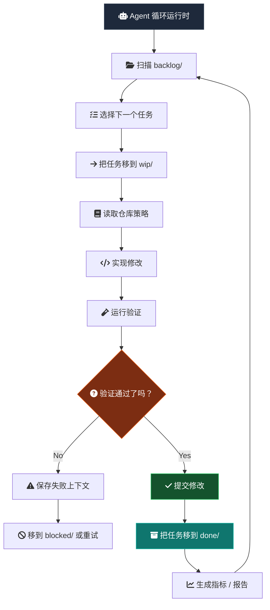
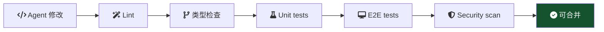
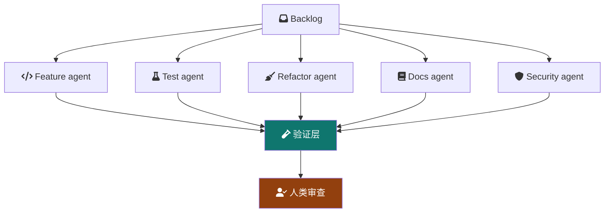
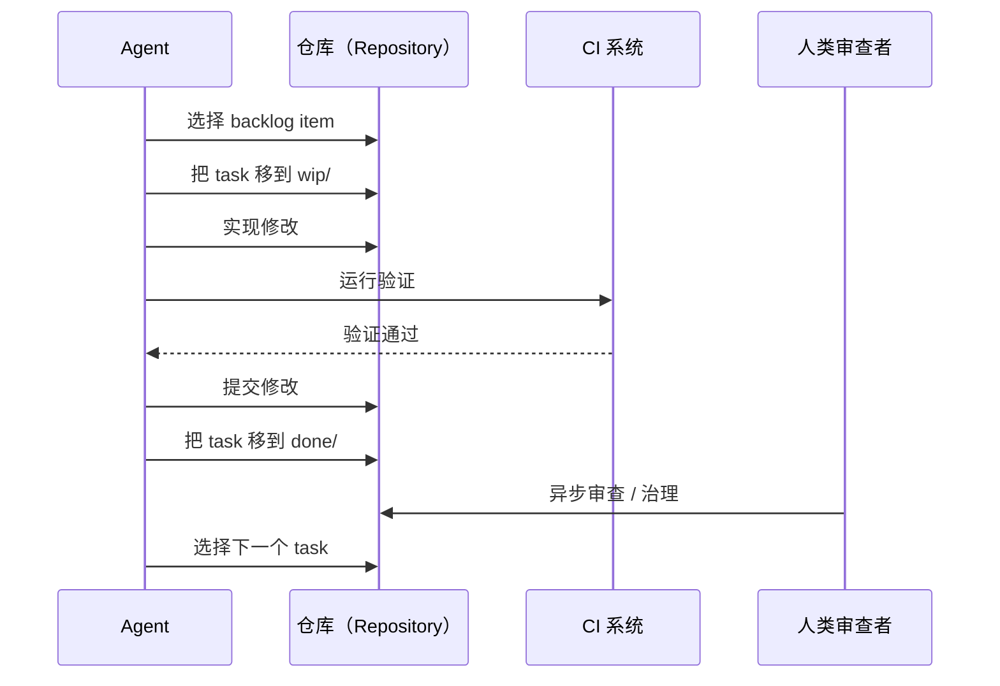

> 如果仓库（Repository）本身就是调度器（Scheduler）呢？

现在多数 AI 编码工作流仍然是会话驱动（session-driven）：

```txt
Human -> Prompt -> Agent -> Stop
```

这很有用，但它把 Agent 当成一次性的聊天参与者。仓库也可以被设计成一个持续演化的系统：Agent 从持久队列（persistent queue）中执行有边界的工作（bounded work），而人类仍然保留审查者、架构师与治理者的角色。

运行模型（operating model）会更接近：

```txt
Human -> Governance -> Continuous Agent Runtime
```

## 基本架构

仓库本身成为编排层（orchestration layer）。

```txt
repo/
├── src/
├── tests/
├── docs/
├── agent/
│   ├── backlog/
│   ├── wip/
│   ├── done/
│   ├── blocked/
│   ├── archive/
│   └── policies/
```

每个工程任务都是一个文件：

```txt
agent/backlog/add-search-unit-tests.md
agent/backlog/remove-legacy-api-client.md
agent/backlog/improve-error-boundaries.md
```

这和看板（Kanban）类似，因为工作项（work item）会在明确状态之间移动。差别是 git 会记录这些状态转换，所以队列本身变得可审查、可恢复。

## Agent 运行流程



重点不只是 Agent 能自主运行（autonomous）。重点是 Agent 在人类可以检查的状态机（state machine）里运行。

## 为什么使用文件系统看板

很多编排系统最后都会重新发明 git 已经具备的能力。

| 能力 | Git 已经提供 |
| --- | --- |
| Auditability | Commit history |
| Rollback | Git revert |
| Reviewability | Pull requests |
| Ownership | CODEOWNERS |
| Traceability | Commit SHA |
| Replication | Clone/fork |
| Automation | CI/CD |
| State transitions | File movement |

所以队列本身会变成可版本化、可审查、可复现、可观测、可分支化。

## 任务边界

任务文件不应该只有标题。它应该定义 Agent 被允许操作的边界（boundary）。

```md
# Task

Improve order page loading skeleton.

# Goal

Reduce perceived loading delay and improve CLS stability.

# Constraints

- No layout shift after hydration
- Must support static export
- Avoid client-only rendering

# Validation

bun run test
bun run typecheck
bun run build

# Ownership

frontend-platform

# Priority

P2
```

这样 Agent 会得到有边界的执行面（bounded execution surface），审查者也会得到一个容易审计的紧凑契约（compact contract）。

## 不阻塞运行时的人类审计

真正困难的问题不是 Agent 能不能持续工作，而是人类如何继续参与，同时不变成运行时瓶颈（runtime bottleneck）。

答案是把人类责任转向策略、审查和异常处理（exception handling）。


| 角色 | 责任 |
| --- | --- |
| 架构师 | 定义边界 |
| 审查者 | 审计修改 |
| 治理者 | 控制策略 |
| 优先级负责人 | 提供 backlog |
| 事件处理者 | 处理阻塞状态 |

循环可以继续运行，但规则控制权仍然在人类手中。

## 验证才是运行时控制器

Agent 是概率性的（probabilistic）。验证是确定性的（deterministic）。

系统应该把信任从这里移开：

```txt
trusting the agent
```

转向这里：

```txt
trusting the validation system
```



工程质量真正存在于检查、契约、可审查的差异和回滚路径（rollback path）里。

## 自我增长的质量

一个有用的涌现性质（emergent property）是，仓库可以通过小型排队任务逐渐改善自己。

| 分类 | 例子 |
| --- | --- |
| 测试 | 增加缺失的 edge-case tests |
| 重构 | 删除 dead abstractions |
| 类型 | 强化 type safety |
| 性能 | 降低 bundle size |
| 可靠性 | 改善 retry logic |
| DX | 改善 CI feedback |
| 可观测性 | 增加缺失的 tracing |
| 文档 | 保持 docs 同步 |

这更像复利（compound interest），而不是传统项目交付。价值来自许多已经验证的小型改进（micro-improvements），而不是一次大型 rewrite。

## 多 Agent 拓扑

随着时间推移，专业化（specialization）会自然出现。



一开始拓扑应该保持简单。一个带严格队列的单一工作器，比一组 Agent（swarm）更容易治理。只有当验证、所有权和审查容量足够强时，专业化才真正有用。

## 失败模式

这个系统不是魔法。自主性（autonomy）会提高吞吐量（throughput），也会放大错误。

| 风险 | 说明 |
| --- | --- |
| 无限循环 | Agent 反复编辑同一批文件 |
| 验证博弈 | 工作只优化 CI pass |
| 仓库噪音 | commit 很频繁但价值很低 |
| 上下文漂移 | Agent 误解架构意图 |
| 成本爆炸 | token 和 runner usage 失控 |
| PR 过载 | 审查者无法吸收差异量 |
| 虚假生产力 | product value 没增加，activity 却增加 |

自主性越强，治理就越重要。

## 最小原型栈

| 层 | 候选 |
| --- | --- |
| 队列 | Filesystem Kanban |
| 运行时 | Claude Code / Codex / OpenAI Agents |
| 验证 | GitHub Actions |
| 状态 | Git commits |
| 治理 | CODEOWNERS and branch rules |
| 指标 | OpenTelemetry, ELK, Datadog, or Sentry |
| 隔离 | Containerized runner |
| 调度 | Cron or CI scheduler |

第一个原型不需要复杂的控制面（control plane）。它需要小队列、有边界的工作器、确定性的检查，以及清楚规定人类何时审查或停止循环的规则。



## 相关工作

有几个相近方向的项目和论文。GitHub 的 [Agentic Workflows](https://github.com/github/gh-aw) 在尝试可由 Agent 执行的工作定义（work definitions）。GitHub Next 的 [Discovery Agent](https://githubnext.com/projects/discovery-agent/) 探索理解仓库的 Agent（repository-aware agent）如何调查代码库。Microsoft Research 关于 [YoloFS](https://www.microsoft.com/en-us/research/publication/dont-let-ai-agents-yolo-your-files-shifting-information-and-control-to-filesystems-for-agent-safety-and-autonomy/) 的研究认为，文件系统设计可以把信息与控制移向更安全的 Agent 自主性。

风险也开始在研究中变得清楚。[Failed agentic pull requests](https://arxiv.org/abs/2601.15195) 研究了自主编码尝试在实践中如何失败。[TDFlow](https://arxiv.org/abs/2510.23761) 把 Agent 式工作放在 test-driven feedback loop 中理解。关于工作流可视化和 WIP 控制，官方 [Kanban Guide](https://kanban.university/kanban-guide/) 是有用背景。[Backlog](https://backlog.so/) 也是把本地文件用作 Agent 友好任务编排面的相近例子。

## 最后的想法

最大的 unlock 也许不是更聪明的 model。

它可能是这样的 repository design：当人类 offline 时，autonomous engineering work 仍然可以安全继续。

这会把软件工程从人类触发的执行（human-triggered execution）变成受策略约束的持续演化（policy-constrained continuous evolution）。
