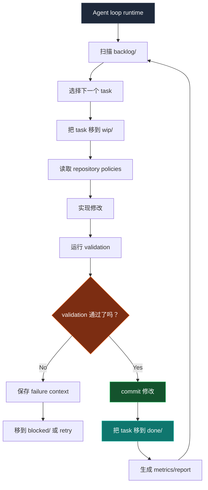
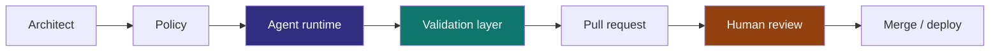
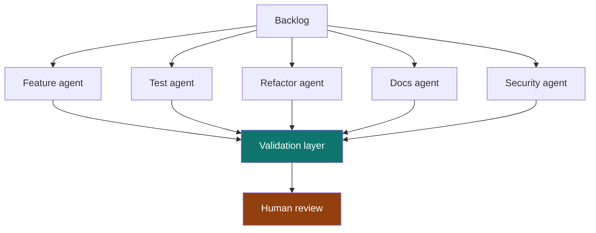
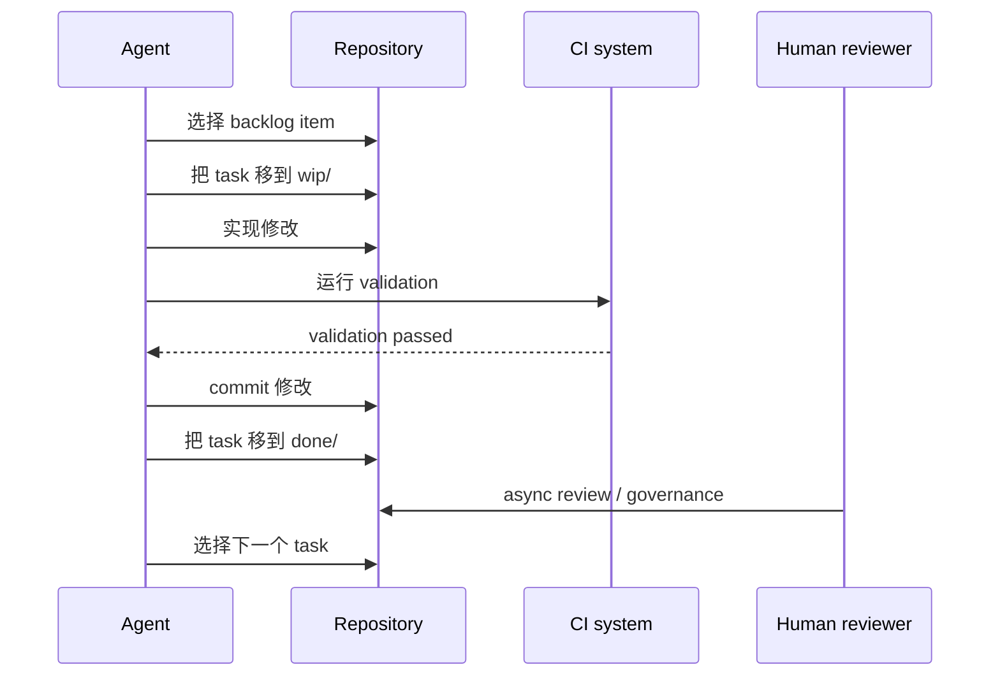

> 如果 Repository 本身就是 Scheduler 呢？

现在多数 AI Coding Workflow 仍然是 session-driven：

```txt
Human -> Prompt -> Agent -> Stop
```

这很有用，但它把 Agent 当成一次性的 chat participant。Repository 也可以被设计成一个持续演化的 system：Agent 从 persistent queue 中执行 bounded work，而人类仍然保留 reviewer、architect 与 governor 的角色。

Operating model 会更接近：

```txt
Human -> Governance -> Continuous Agent Runtime
```

## Core architecture

Repository 本身成为 orchestration layer。

```txt
repo/
├── src/
├── tests/
├── docs/
├── agent/
│   ├── backlog/
│   ├── wip/
│   ├── done/
│   ├── blocked/
│   ├── archive/
│   └── policies/
```

每个 engineering task 都是一个 file：

```txt
agent/backlog/add-search-unit-tests.md
agent/backlog/remove-legacy-api-client.md
agent/backlog/improve-error-boundaries.md
```

这和 Kanban 类似，因为 work item 会在明确状态之间移动。差别是 git 会记录这些状态转换，所以 queue 本身变得可 review、可恢复。

## Agent runtime flow



重点不只是 Agent 能 autonomous。重点是 Agent 在人类可以 inspection 的 state machine 里运行。

## 为什么使用 filesystem Kanban

很多 orchestration system 最后都会重新发明 git 已经具备的能力。

| Capability | Git 已经提供 |
| --- | --- |
| Auditability | Commit history |
| Rollback | Git revert |
| Reviewability | Pull requests |
| Ownership | CODEOWNERS |
| Traceability | Commit SHA |
| Replication | Clone/fork |
| Automation | CI/CD |
| State transitions | File movement |

所以 queue 本身会变成 versioned、reviewable、reproducible、observable、branchable。

## Task boundaries

Task file 不应该只有标题。它应该定义 Agent 被允许操作的 boundary。

```md
# Task

Improve order page loading skeleton.

# Goal

Reduce perceived loading delay and improve CLS stability.

# Constraints

- No layout shift after hydration
- Must support static export
- Avoid client-only rendering

# Validation

bun run test
bun run typecheck
bun run build

# Ownership

frontend-platform

# Priority

P2
```

这样 Agent 会得到 bounded execution surface，reviewer 也会得到一个容易审计的 compact contract。

## Human-auditable without blocking runtime

真正困难的问题不是 Agent 能不能持续工作，而是人类如何继续参与，同时不变成 runtime bottleneck。

答案是把人类 responsibility 转向 policy、review 和 exception handling。



| Role | Responsibility |
| --- | --- |
| Architect | 定义 boundary |
| Reviewer | audit 修改 |
| Governor | 控制 policy |
| Prioritizer | 提供 backlog |
| Incident resolver | 处理 blocked state |

Loop 可以继续运行，但规则控制权仍然在人类手中。

## Validation 才是 runtime controller

Agent 是 probabilistic。Validation 是 deterministic。

System 应该把 trust 从这里移开：

```txt
trusting the agent
```

转向这里：

```txt
trusting the validation system
```


Engineering quality 真正存在于 checks、contracts、reviewable diffs 和 rollback paths 里。

## Self-growing quality

一个有用的 emergent property 是，Repository 可以通过小型 queued task 逐渐改善自己。

| Category | Example |
| --- | --- |
| Testing | 增加缺失的 edge-case tests |
| Refactoring | 删除 dead abstractions |
| Types | 强化 type safety |
| Performance | 降低 bundle size |
| Reliability | 改善 retry logic |
| DX | 改善 CI feedback |
| Observability | 增加缺失的 tracing |
| Docs | 保持 docs 同步 |

这更像 compound interest，而不是传统 project delivery。价值来自许多 validated micro-improvements，而不是一次大型 rewrite。

## Multi-agent topology

随着时间推移，specialization 会自然出现。



一开始 topology 应该保持无聊。一个带严格 queue 的 single worker 比 swarm 更容易治理。只有当 validation、ownership 和 review capacity 足够强时，specialization 才真正有用。

## Failure modes

这个 system 不是魔法。Autonomy 会提高 throughput，也会放大 mistake。

| Risk | Description |
| --- | --- |
| Infinite loops | Agent 反复编辑同一批 file |
| Validation gaming | 工作只优化 CI pass |
| Repo churn | commit 很频繁但 value 很低 |
| Context drift | Agent 误解 architecture intent |
| Cost explosion | token 和 runner usage 失控 |
| PR overload | reviewer 无法吸收 diff volume |
| False productivity | activity 增加但 product value 没增加 |

Autonomy 越强，governance 就越重要。

## Minimal prototype stack

| Layer | Suggested choice |
| --- | --- |
| Queue | Filesystem Kanban |
| Runtime | Claude Code / Codex / OpenAI Agents |
| Validation | GitHub Actions |
| State | Git commits |
| Governance | CODEOWNERS and branch rules |
| Metrics | OpenTelemetry, ELK, Datadog, or Sentry |
| Isolation | Containerized runner |
| Scheduling | Cron or CI scheduler |

第一个 prototype 不需要复杂的 control plane。它需要 small queue、bounded worker、deterministic checks，以及清楚规定人类何时 review 或 stop loop 的规则。



## Related work

有几个相近方向的 project 和 paper。GitHub 的 [Agentic Workflows](https://github.com/github/gh-aw) 在尝试可由 agent 执行的 work definitions。GitHub Next 的 [Discovery Agent](https://githubnext.com/projects/discovery-agent/) 探索 repository-aware agent 如何调查 codebase。Microsoft Research 关于 [YoloFS](https://www.microsoft.com/en-us/research/publication/dont-let-ai-agents-yolo-your-files-shifting-information-and-control-to-filesystems-for-agent-safety-and-autonomy/) 的研究认为，filesystem design 可以把 information 与 control 移向更安全的 agent autonomy。

风险也开始在研究中变得清楚。[Failed agentic pull requests](https://arxiv.org/abs/2601.15195) 研究了 autonomous coding attempt 在实践中如何失败。[TDFlow](https://arxiv.org/abs/2510.23761) 把 agentic work 放在 test-driven feedback loop 中理解。关于 workflow visualization 和 WIP control，official [Kanban Guide](https://kanban.university/kanban-guide/) 是有用背景。[Backlog](https://backlog.so/) 也是把 local files 用作 agent-friendly task orchestration surface 的相近例子。

## Final thought

最大的 unlock 也许不是更聪明的 model。

它可能是这样的 repository design：当人类 offline 时，autonomous engineering work 仍然可以安全继续。

这会把 software engineering 从 human-triggered execution 变成 policy-constrained continuous evolution。
