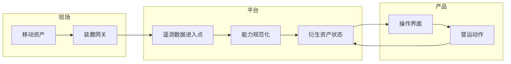

移动资产的云端界面，不能把位置、连线与装置状态当成稳定事实；它们更像是带有时间与信心程度的输入。

## 系统边界

## 开发考量

这类界面最常见的错误，是把资产当成数据库里的一笔数据。移动资产有位置，但位置有新鲜度。它有装置状态，但状态可能来自 heartbeat、延迟批次或最后一次收到的消息。它有网络路径，但使用者最需要信心时，路径可能刚好不可用。

这会改变前端模型。UI 应该把数据新鲜度放在数值旁边，而不是藏在 tooltip。它也应该区分「未知」、「过期」、「离线」与「尚未设定」，而不是全部收敛成一般错误。这些标签是产品设计，也是前端、后端与遥测管线之间的技术契约。

实作上，我会用衍生 view model 来表达移动资产，而不是直接把原始装置 payload 绑到 component。原始 payload 可以保留传输层细节；view model 则提供 UI 稳定字段：识别、最后观测位置、最后观测时间、连线状态、分类与可用动作。这样 rendering code 不需要理解太多装置协议。

| 关注点 | 开发含意 |
| --- | --- |
| 位置持续变动 | 显示新鲜度与信心，而不只是坐标。 |
| 连线不稳定 | 把缺少更新视为一级状态。 |
| 装置家族不同 | 在 component 层之前先规范化能力。 |
| 操作者需要快速扫描 | 优先处理状态层级，而不是装饰细节。 |

## 可延续的模式

以 2016 年左右的 web stack 来看，这可以用 REST endpoint、Rails JSON API、Knockout view model、Angular component，或 polling 与 WebSocket 的混合来实作。工具选择重要，但更重要的是契约：每个移动资产界面都需要一套描述不确定性的语汇。有了那套语汇，系统才能告诉使用者它知道什么、不知道什么，以及哪些操作仍然安全。
