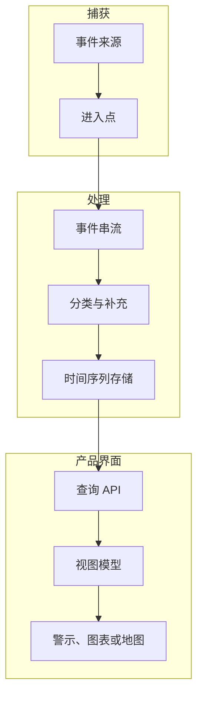

当界面依赖「发生了什么、何时发生、系统能否解释」时，事件管线就成为使用者体验的一部分。

## 管线形状

## 开发考量

当界面依赖事件顺序、新鲜度与诠释时，事件数据就会变成使用者体验。图表、alert list 或 map marker 不是单纯 render data；它是在提出一个主张：某件事发生了，而且系统理解到足以把它呈现出来。

开发上的挑战通常落在原始事件保真度与产品可用性之间。Raw event stream 保留对 debug 与分析有用的细节，但使用者界面需要稳定语意：事件类型、观测时间、受影响资产、严重度、信心程度，以及是否可操作。这个 mapping 应该被明确设计，而不是散落在 component logic 里。

当前端透过 API 查询 time-series 或 event data 时，查询契约会影响信任。Pagination、time range、deduplication、timezone handling 与 null field 都会改变使用者对系统的判断。如果 UI 静默丢掉格式不完整的事件，使用者看到的是「没有」。如果 UI 显示所有 raw edge case，使用者看到的是噪音。产品需要一层把事件数据转成可理解状态的中介。

| 管线层 | UX 责任 |
| --- | --- |
| Ingestion | 保留足够来源细节，以便 debug 遗失或延迟事件。 |
| Stream processing | 附上稳定的事件语意与严重度。 |
| Storage/query | 让时间窗与筛选行为可预期。 |
| UI rendering | 解释新鲜度、空状态与可操作性。 |

## 可延续的模式

到 2018 年，营运型产品常会组合 stream processing、Kafka-style event transport、Druid 或 Elasticsearch 这类分析查询，以及用 Chart.js、D3 或自订地图视图做出的 dashboard。可重复的重点是：事件管线不是纯后端基础设施。它决定前端能否对营运现实提出可信的说法。
