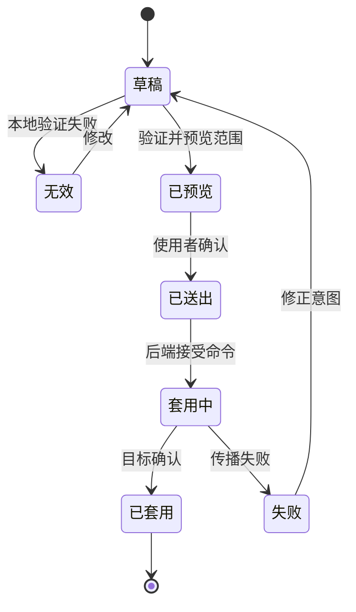

分散式系统的设置界面，需要先让变更变得可理解，再让变更变得容易。

## 设置生命周期

## 开发考量

设置界面有风险，因为它把人的意图转成分散式行为。一个按钮可能改变装置回报方式、alert 触发方式，或谁会收到营运消息。界面不能把这件事当成一般 form submission。

主要开发考量是让 scope 可见。套用变更之前，使用者需要知道哪些对象会受影响、哪些规则正在改变、必要字段是否完整，以及系统接下来会做什么。UI 应该根据变更后果提供 validation、preview 与 confirmation，而不只是根据表单形状。

实作上，这通常适合 draft model。UI 编辑 local draft，对 typed contract 做 validation，预览受影响 target，然后才送出 command。送出后，UI 不应该立刻暗示成功，除非后端已确认 propagation，或至少已接受 job。在分散式系统里，「saved」与「applied」是不同状态。

| UI 状态 | 意义 |
| --- | --- |
| Draft | 使用者正在编辑尚未影响系统的意图。 |
| Validated | 系统能理解这次变更请求。 |
| Submitted | 变更请求已被接受处理。 |
| Applied | 受影响 target 已观测或确认变更。 |
| Failed | 系统能解释变更停在哪里。 |

## 可延续的模式

无论 stack 是 Rails、Node.js、Java service，或 API 后面接 message queue，有用的模式都一样：把 editing 与 applying 分开。设置界面应该把 draft、validation、submission、propagation 与 observation 建模成不同产品状态，因为使用者感受到的也是不同状态。
