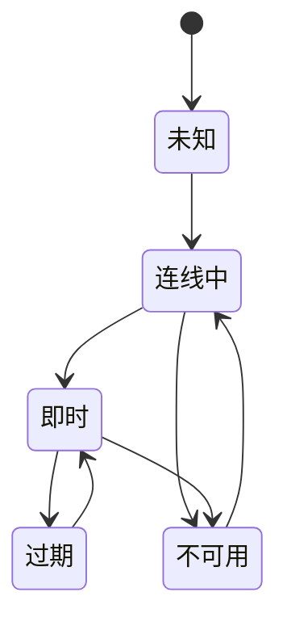

靠近硬件的前端工作，必须呈现现实，但不能假装浏览器控制了现实。

## 边界假设

| 前端假设 | 硬件与网络现实 |
| --- | --- |
| 数据会照 request 顺序抵达。 | 装置数据可能延迟、缺失或重播。 |
| 错误是应用程序状态。 | 错误可能来自覆盖缺口、电源或物理条件。 |
| Refresh 是无害的。 | Refresh 可能掩盖 state machine 或 stream setup 问题。 |
| UI state 是 local 的。 | UI state 常反映仍在收敛的远端系统。 |

## 开发考量

硬件相邻的前端工作，迫使浏览器代表它无法控制的系统。UI 可以要求 stream、画 map marker 或送出 configuration，但它无法保证无线覆盖、装置电源、sensor health 或 clock accuracy。

这应该改变 component 设计方式。UI 需要明确的不确定性，而不是乐观假设。Map marker 可以有 last-known time。Camera tile 可以分开 stream setup 与 media availability。Sensor reading 可以显示 fresh、stale 或 outside expected range。这些不是装饰标签，而是产品说实话的方式。

开发架构应该避免把 hardware condition 分散到许多 component。比较好的形状，是把 raw device 与 network signal 规范化成一小组 UI state。Component 一致地 render 这些 state，测试也可以覆盖 state matrix，而不需要重建整个外部系统。

## 状态模型草图

## 可延续的模式

工程姿态很简单：靠近硬件的前端程序代码应该谦逊、明确、可观测。无论 UI 是 Angular、React、Knockout 或 plain JavaScript，浏览器都不应该假装自己比装置、网络与 stream pipeline 拥有更强保证。
