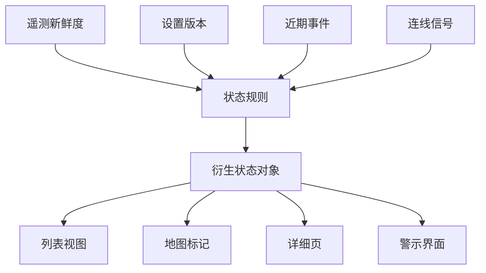

当人们用装置状态来决定要信任什么、检查什么、下一步改什么，它就成为产品界面。

## 状态推导

## 开发考量

装置状态是一层诠释。后端可能知道很多事：last message time、firmware version、connectivity result、configuration version、location 与 recent events。使用者需要的是更小的答案：这个装置健康吗、是否需要注意、接下来能做什么？

产品界面位在这两个世界中间。它要在重要的地方保留技术细节，但不应该强迫每个操作者检查 raw telemetry。这通常代表要用清楚规则建立 derived status，并让规则足够可见，让使用者信任结果。

对前端开发来说，重要 artifact 是 status contract。Component 应该收到包含 label、severity、freshness、explanation 与 available actions 的 status object。这个 contract 让 list、detail page、map 与 alert 可以一致渲染。

| 状态字段 | 为什么重要 |
| --- | --- |
| Label | 给使用者可快速扫描的状态。 |
| Severity | 帮助排定注意优先顺序。 |
| Freshness | 避免过期数据看起来像现在状态。 |
| Explanation | 让衍生状态可被理解。 |
| Available actions | 把状态连到营运下一步。 |

## 可延续的模式

Status 是产品 API，不只是数据库 projection。Time-series store、cache、search index 与 stream processor 都可以馈入状态，但 user-facing contract 应该保持稳定：正在发生什么、信号有多新、系统为什么这样判断、接下来能做什么。
