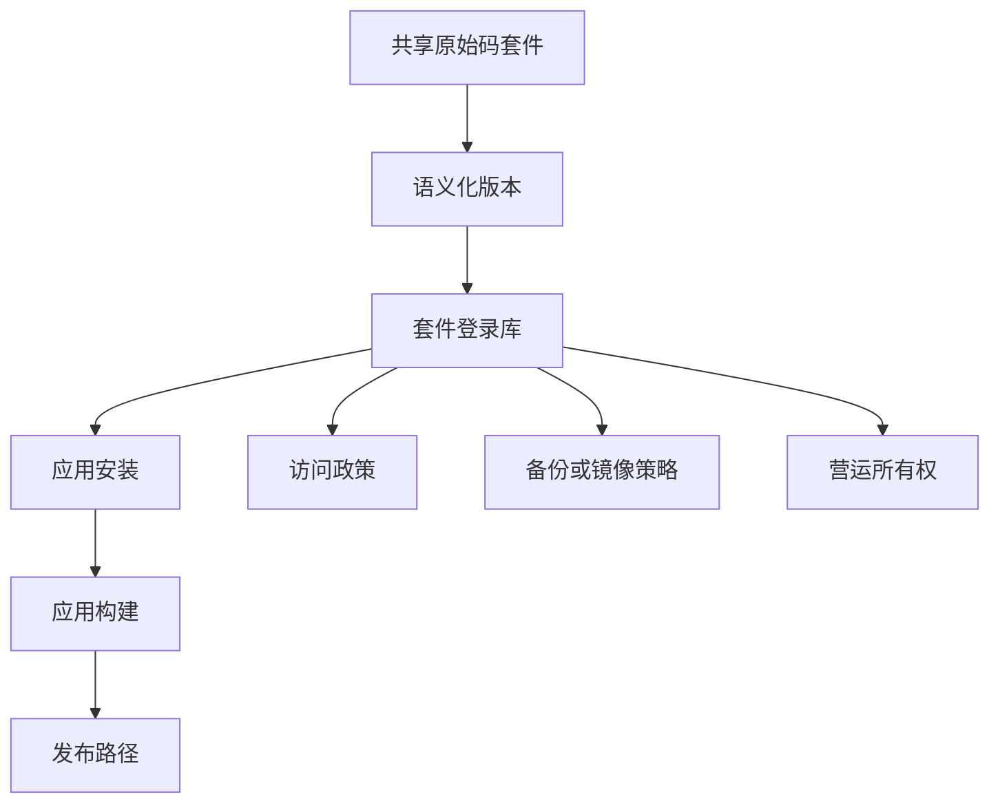

私有 package registry 一开始像是开发便利工具；一旦产品 build 离不开它，它就成为基础设施。

## 依赖拓扑

## 开发考量

私有 package registry 常从效率工具开始。团队把 authentication helper、UI utility、chart wrapper 或 environment glue 抽成 shared package，让应用可以更快前进。当 production build 依赖那个 registry，它就变成 infrastructure。

这个转变会改变工程要求。Access 需要文档化。Ownership 需要清楚。当有人换机器、换网络或换部署环境，build 仍需要可重现。Package publishing 需要 versioning discipline，避免一个团队不小心破坏另一个团队。

前端关注的不只是安装。Shared package 会塑造 application architecture。如果 package 拥有太多产品行为，每个 consuming app 都继承 hidden coupling。如果它拥有太少，又会变成只有 release overhead 的薄 wrapper。比较有用的边界，通常是 API 小而稳定、兼容性期待清楚的 utility 或 primitive。

## Registry 作为基础设施

| Infrastructure concern | Package registry 对应问题 |
| --- | --- |
| Availability | 应用需要 build 时，能否安装 dependency？ |
| Access control | 正确的人与系统能否读取或发布 package？ |
| Disaster recovery | Registry 不可用时，package 能否 restore 或 mirror？ |
| Observability | 团队能否快速辨识 publish、install 与 version 问题？ |

## 可延续的模式

npm、Yarn、Verdaccio、Artifactory、Nexus 与 cloud-hosted registries 都让 package sharing 看起来很日常，但 operating model 仍然重要。当 release 依赖它时，开发便利就变成产品基础设施。
