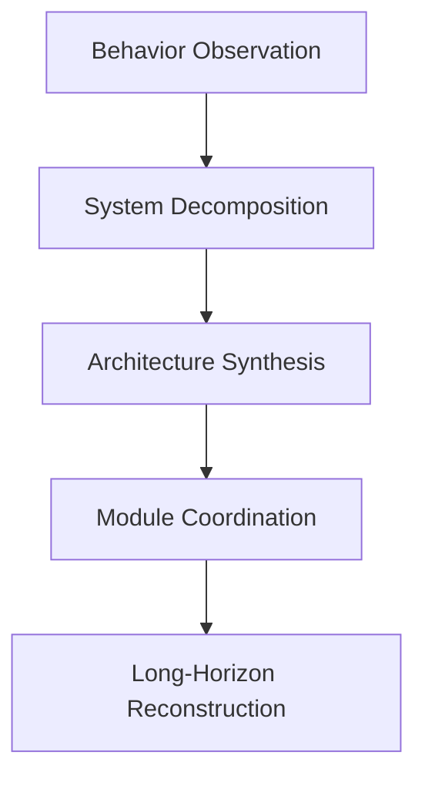
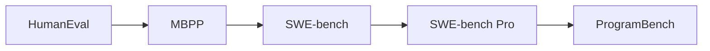
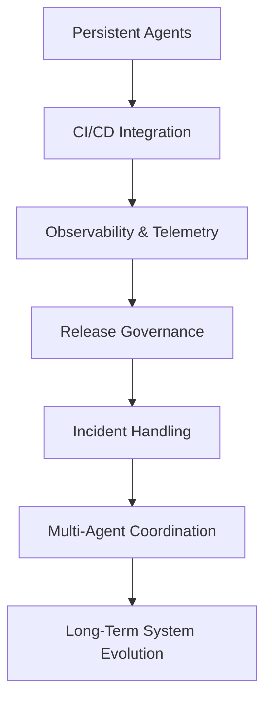

_為什麼「會寫 code」已經不是真正的問題_

過去幾年，AI coding 的討論幾乎都圍繞著一個核心敘事：

> 模型越來越會寫 code。

從：

- HumanEval
- MBPP
- SWE-bench

到後來的 SWE-bench Pro，

大部分 benchmark 的核心都還是在測：

```text
AI 能不能更有效率地完成程式碼生成？
```

但在讀完 Meta FAIR 最近提出的 **ProgramBench** 後，我認為整個方向其實已經開始轉變。

因為 ProgramBench 不再只是問：

```text
AI 會不會寫 code？
```

而是開始問：

```text
AI 能不能重建與設計完整軟體系統？
```

而這兩者之間，其實隔著非常巨大的距離。

## 從 Code Generation 到 System Reconstruction

與 SWE-bench 不同，ProgramBench 幾乎把既有 repo 的支撐全部移除。

它給模型的只有：

- executable binary
- CLI behavior
- README / docs

但：

- 不提供 source code
- 不提供 internet
- 不提供 decompiler

然後要求 agent：

```text
從零重建整個軟體系統
```

包括：

- architecture
- module design
- abstractions
- interfaces
- runtime behavior
- build systems
- edge-case handling

而且最重要的是：

> 它的驗證方式是 behavioral equivalence，而不是 implementation equivalence。

也就是說：

只要最終行為一致，即使內部架構完全不同也可以通過。

這讓它與傳統 coding benchmark 有本質上的差異。

## 為什麼 ProgramBench 很不一樣？

目前大部分 coding benchmark，本質上都還是在測：


但 ProgramBench 開始測的是：



也就是：

```text
從「寫 code」
轉向「建構系統」
```

而我認為這個轉變，其實比目前大部分 benchmark 討論還更重要。

## 最值得注意的結果：模型是怎麼失敗的

這篇 paper 最有趣的地方，其實不是模型分數低。

而是：

```text
模型是如何失敗的
```

paper 裡反覆觀察到：

frontier models 非常容易產生：

- monolithic implementation
- oversized single-file design
- weak abstraction
- poor modular decomposition
- limited architectural layering

這其實是目前 AI coding 最關鍵的限制之一。

因為它揭露了一件很重要的事：

> 現在的 frontier AI 非常擅長修改既有 architecture，
> 但非常不擅長發明 robust architecture。

## Repository Parasite 現象

我自己目前對現代 coding agents 有一個觀察：

只要：

- repo 已存在
- conventions 已存在
- tests 已存在
- CI 已存在
- ownership boundaries 已存在

AI 就會變得非常強。

它們非常擅長：

- patching
- extending
- refactoring
- optimizing

但一旦：

```text
architecture 本身消失
```

能力會快速下降。

這代表目前 frontier AI 更像：

```text
超級強大的 maintenance engineer
```

而不是：

```text
真正的 system architect
```

而這其實跟很多工程師現在實際感受到的現象非常一致。

## 為什麼 AI 會偏向 monolithic？

我認為這並不是偶然。

LLM 的本質是：

```text
token-sequence continuation system
```

它天然擅長：

- 線性延伸
- 區域一致性
- nearby optimization

但 architecture 剛好相反。

好的 architecture 需要：

- future extensibility
- delayed planning
- separation of concerns
- abstraction boundaries
- interface discipline
- non-local reasoning

而這些恰好是 autoregressive systems 最困難的地方。

所以很多 AI generated systems 都會有一種感覺：

```text
能跑，但架構不像人類 architect 設計出來的系統
```

code 可能可以執行。

tests 可能會通過。

但系統結構常缺乏：

- intentional decomposition
- long-term maintainability
- clear abstraction layering

## Benchmark 的演化方向

ProgramBench 其實也反映了整個 benchmark landscape 的演化。

大概長這樣：



每個 benchmark 都在逐步往更高 abstraction 前進：

| Benchmark     | 核心能力                                |
| ------------- | ----------------------------------- |
| HumanEval     | Function generation                 |
| MBPP          | Small program synthesis             |
| SWE-bench     | Repository issue fixing             |
| SWE-bench Pro | Long-horizon repository engineering |
| ProgramBench  | Architecture synthesis              |

而這其實很符合真實世界工程工作的演化。

真正困難的工程問題，通常不是：

- syntax
- algorithm
- local implementation

而是：

- system design
- coordination
- lifecycle management
- complexity control

## Software Engineering 並不等於 Coding

我認為這其實是 ProgramBench 最重要的哲學含義。

真正的 software engineering，從來都不是單純生產 code。

而是：

- complexity management
- constraints handling
- maintainability
- long-term evolution

一個軟體系統真正存在於：

- organizations
- deployment pipelines
- release governance
- observability systems
- operational economics
- ownership structures

傳統 benchmark 幾乎測不到這些東西。

而 ProgramBench 開始透過：

- ambiguity
- reconstruction
- long-horizon reasoning
- architecture formation

逐步碰到這個層面。

## ProgramBench 仍然還沒測到的東西

即使 ProgramBench 已經非常強，但它仍然缺少很多真正軟體工程的重要部分。

### 1. Organizational Constraints

現實世界裡還有：

- product negotiation
- release pressure
- rollback planning
- governance
- security reviews
- operational risk

benchmark 目前仍幾乎沒有測到。

### 2. Long-Term Maintainability

tests pass today，不代表半年後還 maintainable。

真正 architecture quality 的關鍵在於：

- extensibility
- operational simplicity
- future iteration cost
- failure isolation

而這非常難 benchmark。

### 3. Human Coordination

大型 software engineering 本質上是 collaborative system。

很多 architecture decisions 並不是：「理論最優」。

而是因為它們：

- 降低 coordination cost
- 提升 team scalability
- clarify ownership

目前 benchmark 仍主要在測 isolated agents，而不是 socio-technical systems。

## 下一代 Benchmark 可能會長什麼樣子？

我認為 ProgramBench 只是開始。

未來 benchmark 很可能會開始測：



也就是：

benchmark 本身，開始逐漸變成：

```text
software platform problem
```

而不再只是：「model 能不能寫 code」。

## 最後的想法

ProgramBench 真正揭露的是：

> AI 已經逐漸接近「修改軟體」，
> 但離「設計軟體工程系統」仍然有非常大的距離。

而這個距離非常重要。

因為真正高槓桿的工程工作，從來都不是：

- 寫 syntax
- 生成 boilerplate
- 補 implementation

而是：

- shaping systems
- controlling complexity
- enabling future evolution
- coordinating humans and machines over time

而我認為，ProgramBench 很可能會成為第一批真正揭露這條邊界的重要 benchmark 之一。

## References

1. ProgramBench: *Can Language Models Rebuild Programs From Scratch?*  
   [https://arxiv.org/abs/2605.03546](https://arxiv.org/abs/2605.03546)

2. ProgramBench PDF  
   [https://arxiv.org/pdf/2605.03546](https://arxiv.org/pdf/2605.03546)

3. SWE-bench Official Site  
   [https://www.swebench.com/](https://www.swebench.com/)

4. SWE-bench Pro Paper  
   [https://arxiv.org/abs/2509.16941](https://arxiv.org/abs/2509.16941)
