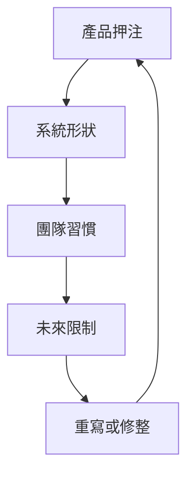

長期產品透過累積來教人：每個架構選擇、團隊變化與市場押注，都會留下痕跡。

## 產品會記得

長期產品奇妙的地方，是即使團隊忘了某些決定，產品仍然記得。Route boundary、status name、chart abstraction、retry behavior 或 package convention，可能穿過好幾輪人員與計畫變動。程式碼繼續帶著舊假設。

這不一定壞。有些舊假設是產品智慧。有些是變成架構的捷徑。困難的是，在重寫一切之前先分辨它們。

## 命名會承重

第一個教訓是：命名比想像中重要。如果產品無法命名 device state、event type、configuration scope 或 ownership boundary，程式碼就會替同一件事發明好幾個名字。那些名字會滲進 API、dashboard、test、incident language 與 onboarding conversation。

這也是前端與平台工作安靜交會的地方。介面上的 label 可能變成 support 使用的語彙。Status enum 可能變成 API contract。Chart grouping 可能變成管理者理解系統的方式。命名不是架構之後的 polish；它是架構的一部分。

## 平台不是一個地方

第二個教訓是：平台工作不只存在於 infrastructure。Frontend component library、status model、package convention、deployment check 或 debugging playbook，只要其他團隊建立在它上面，就可能成為平台工作。

2019 年前後，這常代表同時與多代前端架構共存：較早的 Knockout 或 AngularJS pattern、Angular 或 React component、Rails 或 Node.js API、npm package、CI script，以及由 Chart.js 或 D3 這類公開 library 做出的 dashboard。技術清單不是重點；重點是效果：一旦另一個團隊依賴某個 surface，那個 surface 就有平台責任。

## 不戲劇化地改變

第三個教訓是：rewrite 不是唯一的技術改變形式。產品可以透過 compatibility layer、extracted utility、更好的 route boundary、更清楚的 state model、更嚴格的 validation，以及更可觀測的 release path 來演化。這些變化沒有 rewrite 戲劇化，但常能在降低風險的同時保留交付。

長期產品會懲罰只為下一次 release 最佳化的設計。它也會懲罰把每個舊決定都視為錯誤的團隊。比較好的姿態是問：產品學到了什麼？其中哪些學習值得被整理成更乾淨的介面？

Framework 會變。比較難的問題會留下來：產品暴露什麼狀態、哪些 contract 要穩定、shared code 應該住在哪裡，以及團隊如何知道系統仍然在說實話？
