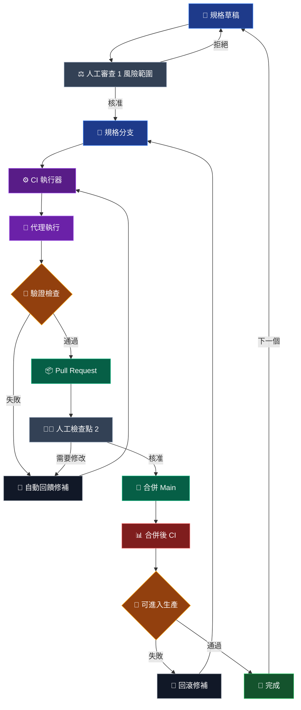

這是一個規格優先的交付迴圈，用來在使用代理時保留工程判斷。

重點不是代理能多快寫出程式碼。重點是工作會通過明確的檢查點，讓風險、驗證與所有權持續可見。

## 運作迴圈

## 為什麼第一個審查重要

第一個人工檢查點不是程式碼審查，而是風險範圍審查。

在代理開始之前，規格應該讓影響範圍清楚可見：哪些地方可以改、哪些地方不能改，以及哪些檢查能證明工作可以接受。這個階段退回很便宜，因為實作還沒有開始產生。

## 代理應該放在哪裡

代理執行應該站在 CI 後面，而不是取代 CI。

代理可以修補、重跑，並回應驗證回饋，但這個迴圈要被測試、型別檢查、建置輸出與可審查的 diff 約束住。這樣速度才會綁在證據上，而不是綁在信心上。

## 為什麼需要第二個檢查點

Pull Request 檢查點讓人判斷結果是否可維護，而不只是是否通過。

如果變更需要調整，就回到回饋修補迴圈。如果通過審查，就合併到 `main`，再用合併後驗證作為獨立的生產準備門檻。

## 完成只是暫時狀態

這個迴圈最後會回到下一份規格草稿。

這很重要，因為代理工程不是一次性的生成事件。它是一種讓交付持續前進的方法，同時保留審查、回滾與生產檢查，讓軟體維持可靠。
