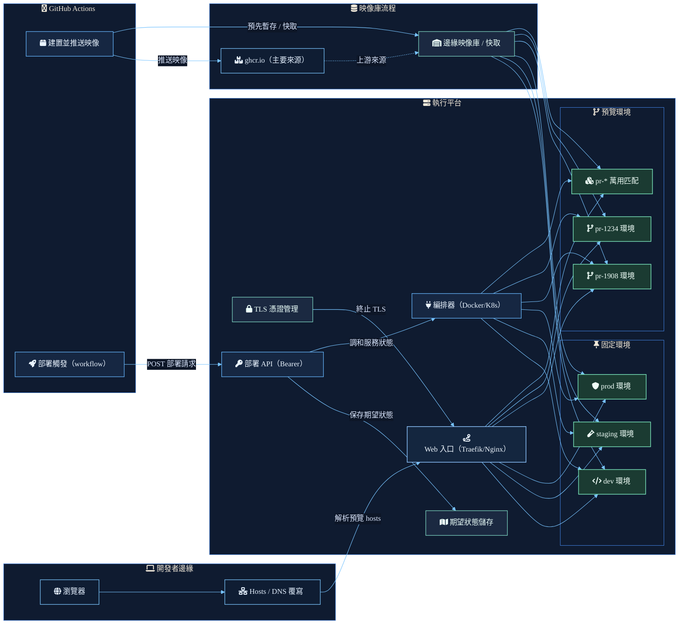

預覽環境要容易操作，工作流就需要拆成清楚的責任。

瀏覽器不需要知道目標是長期存在的 dev 環境，還是短生命週期的 pull request 環境。GitHub Actions 不需要知道 ingress 規則如何套用。runtime 也不應該從目前正在跑的容器反推部署意圖。每個部分都應該只負責一件明確的事。

## 請求路徑

開發者邊緣從本機解析開始。瀏覽器請求會經過 hosts 檔或 DNS override，接著進入平台 ingress。這讓預覽 hostname 變成明確入口，而不是把本機機器和容器位置綁在一起。

## 成品路徑

GitHub Actions 建置映像，並把映像推到作為主要來源的 `ghcr.io`。邊緣 registry 或 cache 則把映像先放到更靠近 runtime 平台的位置，讓固定環境和動態環境都從同一條本地成品路徑取得映像。

## 控制路徑

部署 workflow 會呼叫以 bearer token 保護的 deploy API。這個 API 先記錄期望狀態，再要求 orchestrator reconcile services。關鍵邊界在於：部署意圖要和 runtime side effect 分開保存。

## Runtime 路徑

Orchestrator 會 reconcile 固定環境候選，例如 `dev`、`staging` 和 `prod`，也會 reconcile 動態預覽環境，例如 `pr-1908` 或 `pr-1234`。TLS 在 ingress 層終止，gateway 則把流量導向目前符合請求 hostname 的環境。

結果是一套預覽系統：URL、映像、期望狀態與 service reconciliation 都能分開除錯，但仍然由同一條部署流程串起來。
