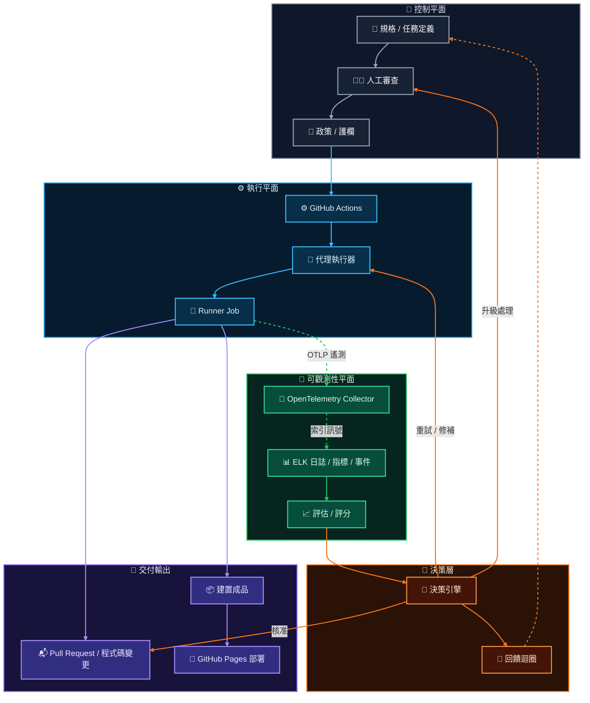

這個模型不只是 `CI -> deploy`，也不只是 `agent -> pull request`。

它把治理拆成幾個平面。控制平面定義意圖與護欄。執行平面產生程式碼與成品。可觀測性平面記錄發生了什麼事。決策層把遙測與審查訊號轉成核准、重試、升級處理，或回饋。

## 執行通道

執行通道維持確定性：

`規格 -> 人工審查 -> 政策 -> GitHub Actions -> 代理執行器 -> Runner Job -> 建置成品 -> GitHub Pages 部署`

這條路徑負責狀態變更。它判斷一個已審查的任務是否可以執行、runner 是否產生了程式碼變更或成品，以及靜態網站成品是否能送到 GitHub Pages。

## 可觀測性通道

可觀測性通道是旁路：

`Runner Job -> OpenTelemetry Collector -> ELK -> 評估 / 評分`

Job 會把日誌、指標、trace 與事件作為 OTLP 遙測送出。Collector 會將訊號標準化，再轉送到 ELK，用於索引、搜尋、儀表板與調查。接著評估流程會把這份紀錄轉成執行分數、異常訊號，以及 pipeline 排名輸入。

## 決策迴圈

決策層消化評估輸出，但不讓可觀測性變成部署依賴。

它可以核准 pull request、要求代理重試並修補、升級回人工審查者，或把學到的經驗回饋到下一個任務定義。這讓迴圈對代理工作有用：判斷保持明確，重試保持有界，系統也會累積證據，知道哪些 job 與 pipeline 值得信任。

## 治理規則

部署不應該依賴日誌是否成功寫入。

如果遙測擷取延遲，或 ELK 無法使用，建置路徑仍然應該能根據自己的檢查完成或失敗。可觀測性的用途是解釋發生了什麼事、比較執行結果、偵測異常，並在事後對 pipeline 評分或排序。

這種分離讓 GitHub Actions 負責交付，而 OpenTelemetry 與 ELK 成為診斷紀錄。結果是一套 CI/CD 系統：執行保持確定性，診斷則足夠豐富，可以支援 job 層級的可追蹤性、異常偵測、評估與 pipeline 治理。
