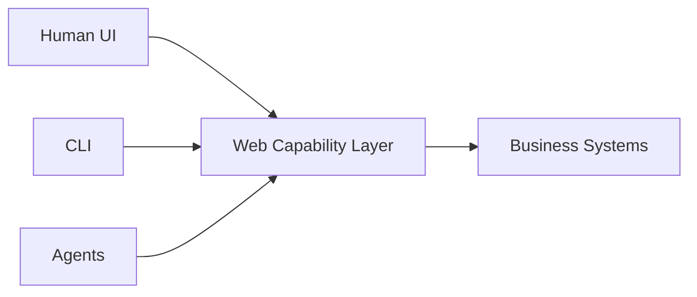

最近看到 [Microsoft Research 的 WebWright 研究文章](https://www.microsoft.com/en-us/research/articles/webwright-a-terminal-is-all-you-need-for-web-agents/)，覺得它其實不只是另一個「AI browser automation」demo。

它比較像是在重新定義：

> 「Browser Agent 到底需不需要 Browser UI？」

## 過去幾年的 Web Agent 問題

大部分 browser agent 都長這樣：

```text
LLM
 ↓
Playwright/Puppeteer
 ↓
Browser UI
 ↓
DOM / screenshot / OCR
```

然後會遇到幾個典型問題：

* screenshot token 成本極高
* DOM 太 noisy
* agent 容易迷路
* browser state 難管理
* automation flaky
* execution slow
* prompt/context 爆炸

很多時候：

> agent 真正需要的不是「畫面」

而是：

> 「可操作的結構化 web state」

## WebWright 的核心概念

WebWright 的思路很有趣。

它把 browser interaction 抽象成：

```text
Terminal Interface
```

而不是 GUI browser。

也就是：

* agent 不看畫面
* agent 不操作滑鼠
* agent 不做 screenshot reasoning

而是：

```text
Agent ↔ Structured Web Environment
```

有點像：

```text
Browser → Shell
```

## 它真正想解的是什麼？

我認為核心是：

### 1. 降低 token 消耗

Screenshot + OCR 是非常昂貴的。

尤其 enterprise workflow：

* admin panel
* dashboard
* CRM
* CMS
* ERP
* internal tools

這些 UI 大量重複。

其實不需要：

```text
「看懂畫面」
```

而是：

```text
「知道有哪些 action 可做」
```

### 2. 降低 agent ambiguity

Browser 最大問題：

```text
畫面對人類友善
但對 agent 不友善
```

Terminal interaction 則偏向：

```text
state-driven
action-driven
```

這對 agent 非常重要。

### 3. 讓 agent 更 deterministic

GUI automation 最大問題之一：

```text
flaky
```

例如：

* modal timing
* animation
* lazy render
* z-index
* overlay
* viewport
* responsive layout

Terminal abstraction 其實是在做：

```text
semantic interaction layer
```

不是 pixel interaction。

## 我認為它真正重要的地方

我覺得 WebWright 最重要的不是：

> 「terminal 控 browser」

而是：

> 「Web 開始被重新抽象」

過去：

```text
Human-first Web
```

現在開始變成：

```text
Agent-first Web
```

這件事其實很大。

## 未來可能的演化

我認為會慢慢變成：



也就是：

UI 不再是唯一入口。

Agent 會直接操作：

* workflow
* forms
* navigation
* state
* actions
* capabilities

## 對 Frontend Architecture 的衝擊

這件事對 frontend architecture 其實非常有影響。

因為很多系統現在：

```text
只有 UI
沒有 capability abstraction
```

但 agent 時代會開始需要：

```text
UI Layer
Capability Layer
Agent Layer
Automation Layer
```

甚至：

> 「UI 只是 capability 的其中一種 renderer」

## 我最近越來越相信的一件事

未來很多 enterprise system：

不是：

```text
Human → UI → Backend
```

而會變成：

```text
Human
   ↓
Agents
   ↓
Capability APIs
   ↓
Systems
```

Browser 可能只剩：

* visualization
* approval
* override
* observability

## WebWright 讓我想到的另一件事

這其實跟最近：

* Codex
* Claude Code
* OpenAI Agents
* CI Agents
* Harness Engineering

正在收斂到同一方向：

> 「Execution Interface Standardization」

也就是：

> Agent 不需要 UI。
> Agent 需要的是：
>
> * deterministic execution
> * observable state
> * structured actions
> * recoverable workflow

## 結尾

我覺得 WebWright 不一定會是最後的解法。

但它代表了一個很重要的方向：

> Browser 不再只是給人類使用。

而是開始變成：

```text
Agent Runtime
```

這可能會重新定義：

* frontend engineering
* web architecture
* automation
* DevOps
* enterprise workflow
* software interaction itself

未來幾年應該會越來越有意思。
